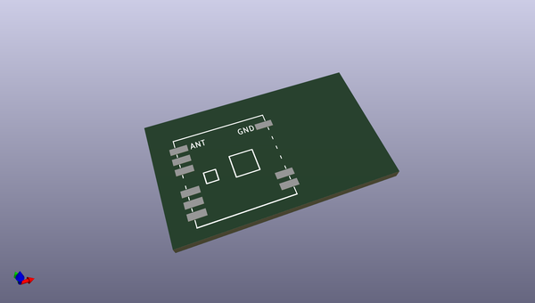

# OOMP Footprint  
##   by none  
  
oomp key: oomp_candykingdom_homebrew_rfm69cw_minimalpads  
  
source repo at: [http://gitlab.com/candykingdom/homebrew.pretty/blob/master/‎EG1206‎_SLIDE_SWITCH.kicad_mod](http://gitlab.com/candykingdom/homebrew.pretty/blob/master/‎EG1206‎_SLIDE_SWITCH.kicad_mod)  
## Footprint  
  
  
  
  
| name | value | 
| --- | --- | 
| footprint name |  | 
| footprint description |  | 
| number of pads |  | 
| github path | http://github.com/candykingdom/homebrew.pretty/blob/master/RFM69CW-minimalpads.kicad_mod | 
| oomp key | oomp_candykingdom_homebrew_rfm69cw_minimalpads | 
| oomp bot github | https://github.com/oomlout/oomlout_oomp_footprint_bot/tree/main/footprints/candykingdom_homebrew_rfm69cw_minimalpads/working | 
## Images  
