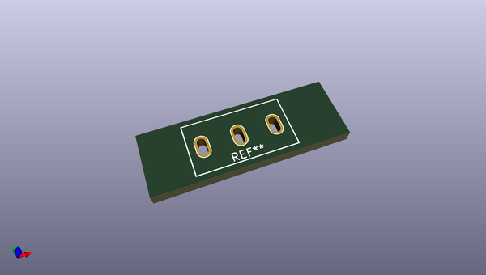
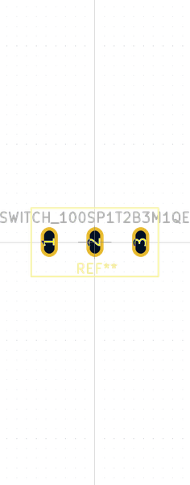

# OOMP Footprint  
## SWITCH_100SP1T2B3M1QEH  by none  
  
oomp key: oomp_candykingdom_homebrew_switch_100sp1t2b3m1qeh  
  
source repo at: [http://gitlab.com/candykingdom/homebrew.pretty/blob/master/‎EG1206‎_SLIDE_SWITCH.kicad_mod](http://gitlab.com/candykingdom/homebrew.pretty/blob/master/‎EG1206‎_SLIDE_SWITCH.kicad_mod)  
## Footprint  
  
  
  
  
| name | value | 
| --- | --- | 
| footprint name | SWITCH_100SP1T2B3M1QEH | 
| footprint description | None | 
| number of pads | 3 | 
| github path | http://github.com/candykingdom/homebrew.pretty/blob/master/SWITCH_100SP1T2B3M1QEH.kicad_mod | 
| oomp key | oomp_candykingdom_homebrew_switch_100sp1t2b3m1qeh | 
| oomp bot github | https://github.com/oomlout/oomlout_oomp_footprint_bot/tree/main/footprints/candykingdom_homebrew_switch_100sp1t2b3m1qeh/working | 
## Images  
