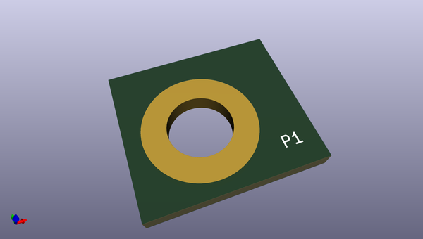
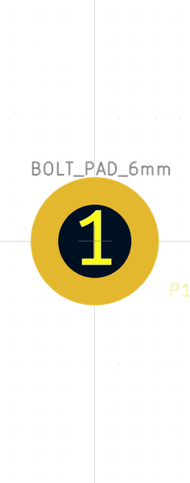

# OOMP Footprint  
## BOLT_PAD_6mm  by none  
  
oomp key: oomp_celeritous_kicad_bolt_pad_6mm  
  
source repo at: [http://gitlab.com/celeritous/KiCad.pretty/blob/master/XTAL_7X5MM.kicad_mod](http://gitlab.com/celeritous/KiCad.pretty/blob/master/XTAL_7X5MM.kicad_mod)  
## Footprint  
  
  
  
  
| name | value | 
| --- | --- | 
| footprint name | BOLT_PAD_6mm | 
| footprint description | None | 
| number of pads | 1 | 
| github path | http://github.com/celeritous/KiCad.pretty/blob/master/BOLT_PAD_6mm.kicad_mod | 
| oomp key | oomp_celeritous_kicad_bolt_pad_6mm | 
| oomp bot github | https://github.com/oomlout/oomlout_oomp_footprint_bot/tree/main/footprints/celeritous_kicad_bolt_pad_6mm/working | 
## Images  
