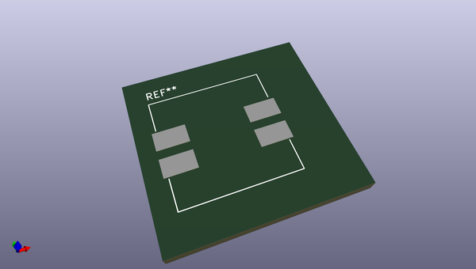

# OOMP Footprint  
## XFMR_COILCRAFT_MSD1583  by none  
  
oomp key: oomp_celeritous_kicad_xfmr_coilcraft_msd1583  
  
source repo at: [http://gitlab.com/celeritous/KiCad.pretty/blob/master/XTAL_7X5MM.kicad_mod](http://gitlab.com/celeritous/KiCad.pretty/blob/master/XTAL_7X5MM.kicad_mod)  
## Footprint  
  
  
  
  
| name | value | 
| --- | --- | 
| footprint name | XFMR_COILCRAFT_MSD1583 | 
| footprint description | None | 
| number of pads | 4 | 
| github path | http://github.com/celeritous/KiCad.pretty/blob/master/XFMR_COILCRAFT_MSD1583.kicad_mod | 
| oomp key | oomp_celeritous_kicad_xfmr_coilcraft_msd1583 | 
| oomp bot github | https://github.com/oomlout/oomlout_oomp_footprint_bot/tree/main/footprints/celeritous_kicad_xfmr_coilcraft_msd1583/working | 
## Images  
