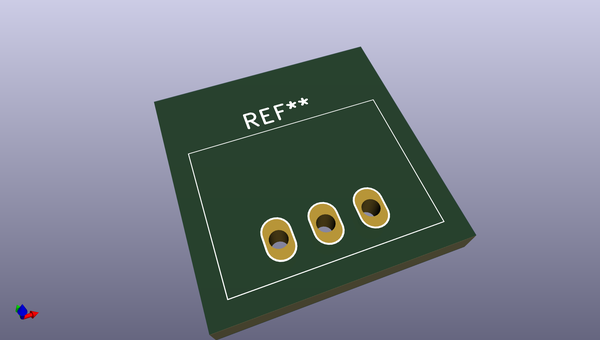
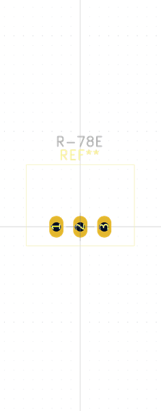

# OOMP Footprint  
## R-78E  by none  
  
oomp key: oomp_christianlerche_lerchetech_r_78e  
  
source repo at: [http://gitlab.com/ChristianLerche/LercheTech_KiCAD/blob/master/LercheTech.pretty/WQFN_40_EP.kicad_mod](http://gitlab.com/ChristianLerche/LercheTech_KiCAD/blob/master/LercheTech.pretty/WQFN_40_EP.kicad_mod)  
## Footprint  
  
  
  
  
| name | value | 
| --- | --- | 
| footprint name | R-78E | 
| footprint description | None | 
| number of pads | 3 | 
| github path | http://github.com/ChristianLerche/LercheTech_KiCAD/blob/master/LercheTech.pretty/R-78E.kicad_mod | 
| oomp key | oomp_christianlerche_lerchetech_r_78e | 
| oomp bot github | https://github.com/oomlout/oomlout_oomp_footprint_bot/tree/main/footprints/christianlerche_lerchetech_r_78e/working | 
## Images  
