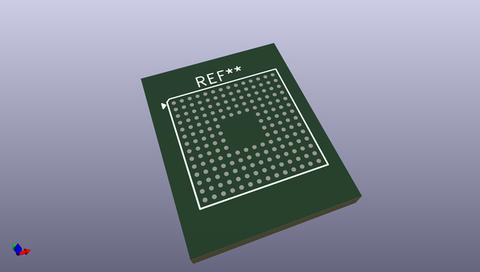
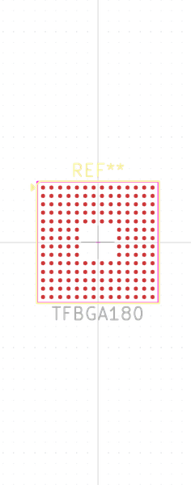

# OOMP Footprint  
## TFBGA180  by none  
  
oomp key: oomp_christianlerche_lerchetech_tfbga180  
  
source repo at: [http://gitlab.com/ChristianLerche/LercheTech_KiCAD/blob/master/LercheTech.pretty/WQFN_40_EP.kicad_mod](http://gitlab.com/ChristianLerche/LercheTech_KiCAD/blob/master/LercheTech.pretty/WQFN_40_EP.kicad_mod)  
## Footprint  
  
  
  
  
| name | value | 
| --- | --- | 
| footprint name | TFBGA180 | 
| footprint description | None | 
| number of pads | 180 | 
| github path | http://github.com/ChristianLerche/LercheTech_KiCAD/blob/master/LercheTech.pretty/TFBGA180.kicad_mod | 
| oomp key | oomp_christianlerche_lerchetech_tfbga180 | 
| oomp bot github | https://github.com/oomlout/oomlout_oomp_footprint_bot/tree/main/footprints/christianlerche_lerchetech_tfbga180/working | 
## Images  
