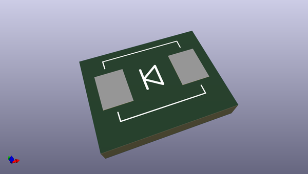
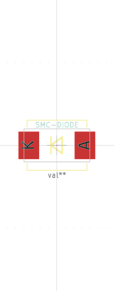

# OOMP Footprint  
## SMC-DIODE  by none  
  
oomp key: oomp_chriswags_freetronics_footprints_diode_smc  
  
source repo at: [http://gitlab.com/chriswags/KiCad/blob/master/mods/RF.pretty/XMIT.kicad_mod](http://gitlab.com/chriswags/KiCad/blob/master/mods/RF.pretty/XMIT.kicad_mod)  
## Footprint  
  
  
  
  
| name | value | 
| --- | --- | 
| footprint name | SMC-DIODE | 
| footprint description | <b>Diode</b>
 | 
| number of pads | 2 | 
| github path | http://github.com/chriswags/KiCad/blob/master/mods/freetronics_footprints.pretty/DIODE_SMC.kicad_mod | 
| oomp key | oomp_chriswags_freetronics_footprints_diode_smc | 
| oomp bot github | https://github.com/oomlout/oomlout_oomp_footprint_bot/tree/main/footprints/chriswags_freetronics_footprints_diode_smc/working | 
## Images  
