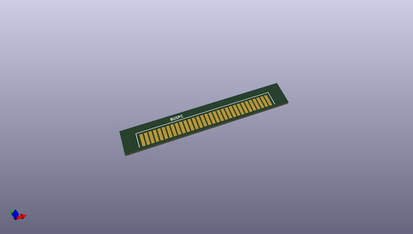
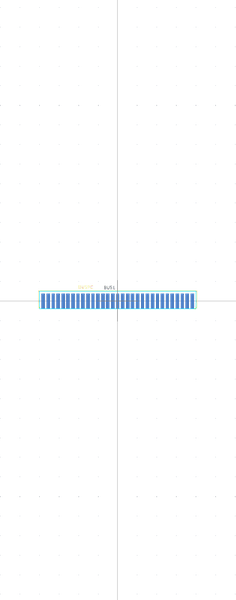

# OOMP Footprint  
## BUS_PC  by none  
  
oomp key: oomp_chriswags_interf_u_bus_pc  
  
source repo at: [http://gitlab.com/chriswags/KiCad/blob/master/mods/RF.pretty/XMIT.kicad_mod](http://gitlab.com/chriswags/KiCad/blob/master/mods/RF.pretty/XMIT.kicad_mod)  
## Footprint  
  
  
  
  
| name | value | 
| --- | --- | 
| footprint name | BUS_PC | 
| footprint description | Connecteur Bus PC 8 bits | 
| number of pads | 62 | 
| github path | http://github.com/chriswags/KiCad/blob/master/demos/interf_u/interf_u.pretty/BUS_PC.kicad_mod | 
| oomp key | oomp_chriswags_interf_u_bus_pc | 
| oomp bot github | https://github.com/oomlout/oomlout_oomp_footprint_bot/tree/main/footprints/chriswags_interf_u_bus_pc/working | 
## Images  
