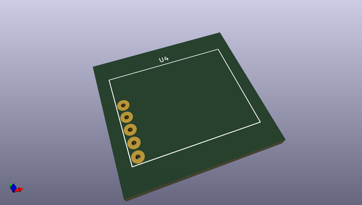
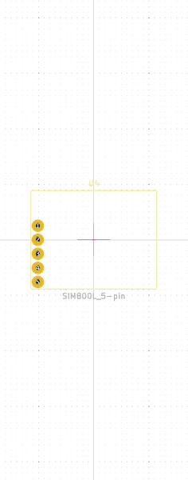

# OOMP Footprint  
## SIM800L_Breakout  by none  
  
oomp key: oomp_coddingtonbear_coddingtonbear_sim800l_breakout  
  
source repo at: [http://gitlab.com/coddingtonbear/coddingtonbear-kicad-lib/blob/master/coddingtonbear.pretty/USB_Thru_hole.kicad_mod](http://gitlab.com/coddingtonbear/coddingtonbear-kicad-lib/blob/master/coddingtonbear.pretty/USB_Thru_hole.kicad_mod)  
## Footprint  
  
  
  
  
| name | value | 
| --- | --- | 
| footprint name | SIM800L_Breakout | 
| footprint description | None | 
| number of pads | 5 | 
| github path | http://github.com/coddingtonbear/coddingtonbear-kicad-lib/blob/master/coddingtonbear.pretty/SIM800L_Breakout.kicad_mod | 
| oomp key | oomp_coddingtonbear_coddingtonbear_sim800l_breakout | 
| oomp bot github | https://github.com/oomlout/oomlout_oomp_footprint_bot/tree/main/footprints/coddingtonbear_coddingtonbear_sim800l_breakout/working | 
## Images  
