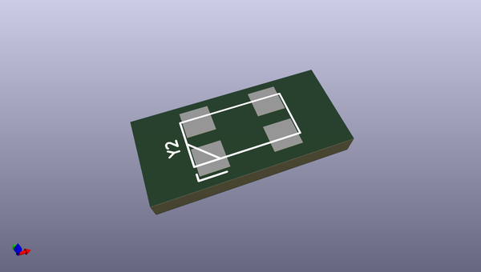
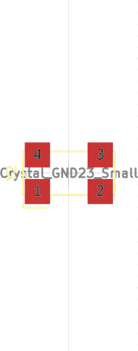

# OOMP Footprint  
## SM-CRYSTAL-ABS25_LargePads  by none  
  
oomp key: oomp_coddingtonbear_coddingtonbear_sm_crystal_abs25_largepads  
  
source repo at: [http://gitlab.com/coddingtonbear/coddingtonbear-kicad-lib/blob/master/coddingtonbear.pretty/USB_Thru_hole.kicad_mod](http://gitlab.com/coddingtonbear/coddingtonbear-kicad-lib/blob/master/coddingtonbear.pretty/USB_Thru_hole.kicad_mod)  
## Footprint  
  
  
  
  
| name | value | 
| --- | --- | 
| footprint name | SM-CRYSTAL-ABS25_LargePads | 
| footprint description | None | 
| number of pads | 4 | 
| github path | http://github.com/coddingtonbear/coddingtonbear-kicad-lib/blob/master/coddingtonbear.pretty/SM-CRYSTAL-ABS25_LargePads.kicad_mod | 
| oomp key | oomp_coddingtonbear_coddingtonbear_sm_crystal_abs25_largepads | 
| oomp bot github | https://github.com/oomlout/oomlout_oomp_footprint_bot/tree/main/footprints/coddingtonbear_coddingtonbear_sm_crystal_abs25_largepads/working | 
## Images  
