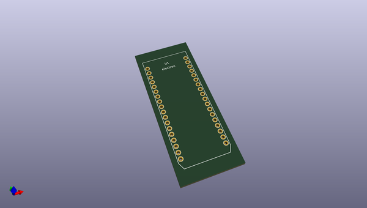
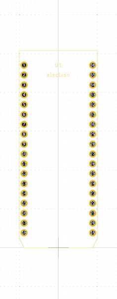

# OOMP Footprint  
## electron  by none  
  
oomp key: oomp_coredump_ch_particle_electron  
  
source repo at: [http://gitlab.com/coredump-ch/particle.pretty/blob/master/spark.kicad_mod](http://gitlab.com/coredump-ch/particle.pretty/blob/master/spark.kicad_mod)  
## Footprint  
  
  
  
  
| name | value | 
| --- | --- | 
| footprint name | electron | 
| footprint description | None | 
| number of pads | 36 | 
| github path | http://github.com/coredump-ch/particle.pretty/blob/master/electron.kicad_mod | 
| oomp key | oomp_coredump_ch_particle_electron | 
| oomp bot github | https://github.com/oomlout/oomlout_oomp_footprint_bot/tree/main/footprints/coredump_ch_particle_electron/working | 
## Images  
