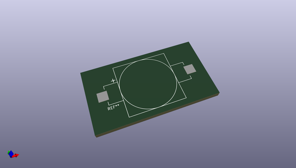
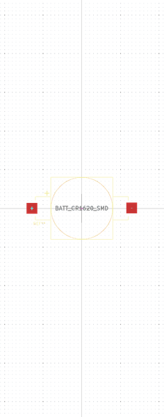

# OOMP Footprint  
## BATT_CR1620_SMD  by none  
  
oomp key: oomp_cormoran_kicad_batt_cr1620_smd  
  
source repo at: [http://gitlab.com/cormoran/kicad.pretty/blob/master/XTAL_7X5MM.kicad_mod](http://gitlab.com/cormoran/kicad.pretty/blob/master/XTAL_7X5MM.kicad_mod)  
## Footprint  
  
  
  
  
| name | value | 
| --- | --- | 
| footprint name | BATT_CR1620_SMD | 
| footprint description | None | 
| number of pads | 2 | 
| github path | http://github.com/cormoran/kicad.pretty/blob/master/BATT_CR1620_SMD.kicad_mod | 
| oomp key | oomp_cormoran_kicad_batt_cr1620_smd | 
| oomp bot github | https://github.com/oomlout/oomlout_oomp_footprint_bot/tree/main/footprints/cormoran_kicad_batt_cr1620_smd/working | 
## Images  
