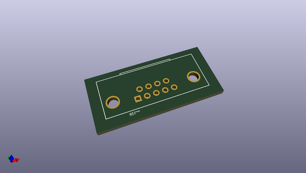

# OOMP Footprint  
## CONN_DB9F_RA_TH  by none  
  
oomp key: oomp_cormoran_kicad_conn_db9f_ra_th  
  
source repo at: [http://gitlab.com/cormoran/kicad.pretty/blob/master/XTAL_7X5MM.kicad_mod](http://gitlab.com/cormoran/kicad.pretty/blob/master/XTAL_7X5MM.kicad_mod)  
## Footprint  
  
  
  
  
| name | value | 
| --- | --- | 
| footprint name | CONN_DB9F_RA_TH | 
| footprint description | None | 
| number of pads | 11 | 
| github path | http://github.com/cormoran/kicad.pretty/blob/master/CONN_DB9F_RA_TH.kicad_mod | 
| oomp key | oomp_cormoran_kicad_conn_db9f_ra_th | 
| oomp bot github | https://github.com/oomlout/oomlout_oomp_footprint_bot/tree/main/footprints/cormoran_kicad_conn_db9f_ra_th/working | 
## Images  
