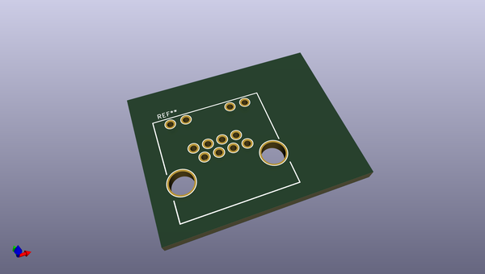
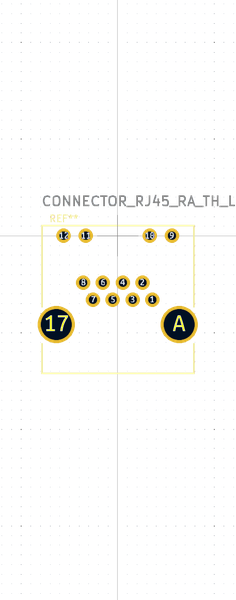

# OOMP Footprint  
## CONNECTOR_RJ45_RA_TH_LEDS  by none  
  
oomp key: oomp_cormoran_kicad_connector_rj45_ra_th_leds  
  
source repo at: [http://gitlab.com/cormoran/kicad.pretty/blob/master/XTAL_7X5MM.kicad_mod](http://gitlab.com/cormoran/kicad.pretty/blob/master/XTAL_7X5MM.kicad_mod)  
## Footprint  
  
  
  
  
| name | value | 
| --- | --- | 
| footprint name | CONNECTOR_RJ45_RA_TH_LEDS | 
| footprint description | None | 
| number of pads | 14 | 
| github path | http://github.com/cormoran/kicad.pretty/blob/master/CONNECTOR_RJ45_RA_TH_LEDS.kicad_mod | 
| oomp key | oomp_cormoran_kicad_connector_rj45_ra_th_leds | 
| oomp bot github | https://github.com/oomlout/oomlout_oomp_footprint_bot/tree/main/footprints/cormoran_kicad_connector_rj45_ra_th_leds/working | 
## Images  
