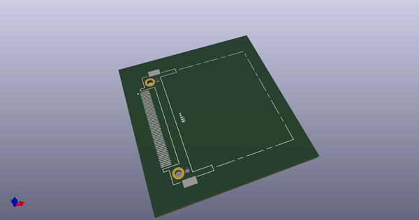
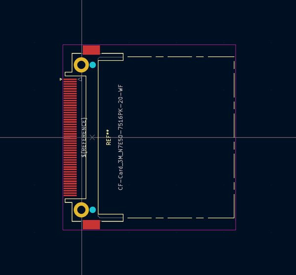
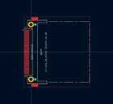
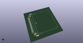
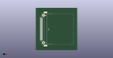

# OOMP Footprint  
## CF-Card_3M_N7E50-7516PK-20-WF  by Iangitpers  
  
oomp key: oomp_iangitpers_connector_card_cf_card_3m_n7e50_7516pk_20_wf  
  
source repo at: [http://github.com/Iangitpers/4a/blob/master/TYPE-C-31-M-12/HRO_TYPE-C-31-M-12.kicad_mod](http://github.com/Iangitpers/4a/blob/master/TYPE-C-31-M-12/HRO_TYPE-C-31-M-12.kicad_mod)  
## Footprint  
  
  
  
  
| name | value | 
| --- | --- | 
| footprint name | CF-Card_3M_N7E50-7516PK-20-WF | 
| footprint description | Compact Flash Card connector (https://multimedia.3m.com/mws/media/22365O/3mtm-cf-card-header-compactflashtm-type-i-sm-ts0662.pdf) | 
| number of pads | 56 | 
| github path | http://github.com/Iangitpers/4a/blob/master/Connector_Card.pretty/CF-Card_3M_N7E50-7516PK-20-WF.kicad_mod | 
| oomp key | oomp_iangitpers_connector_card_cf_card_3m_n7e50_7516pk_20_wf | 
| oomp bot github | https://github.com/oomlout/oomlout_oomp_footprint_bot/tree/main/footprints/iangitpers_connector_card_cf_card_3m_n7e50_7516pk_20_wf/working | 
## Images  
  
  
  
  
  
  
  
  
