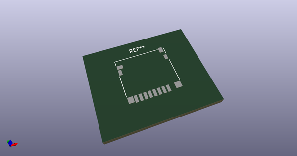
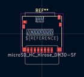
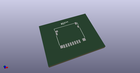
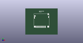

# OOMP Footprint  
## microSD_HC_Hirose_DM3D-SF  by Iangitpers  
  
oomp key: oomp_iangitpers_connector_card_microsd_hc_hirose_dm3d_sf  
  
source repo at: [http://github.com/Iangitpers/4a/blob/master/TYPE-C-31-M-12/HRO_TYPE-C-31-M-12.kicad_mod](http://github.com/Iangitpers/4a/blob/master/TYPE-C-31-M-12/HRO_TYPE-C-31-M-12.kicad_mod)  
## Footprint  
  
  
  
  
| name | value | 
| --- | --- | 
| footprint name | microSD_HC_Hirose_DM3D-SF | 
| footprint description | Micro SD, SMD, right-angle, push-pull (https://media.digikey.com/PDF/Data%20Sheets/Hirose%20PDFs/DM3D-SF.pdf) | 
| number of pads | 14 | 
| github path | http://github.com/Iangitpers/4a/blob/master/Connector_Card.pretty/microSD_HC_Hirose_DM3D-SF.kicad_mod | 
| oomp key | oomp_iangitpers_connector_card_microsd_hc_hirose_dm3d_sf | 
| oomp bot github | https://github.com/oomlout/oomlout_oomp_footprint_bot/tree/main/footprints/iangitpers_connector_card_microsd_hc_hirose_dm3d_sf/working | 
## Images  
  
  
  
  
  
  
  
  
