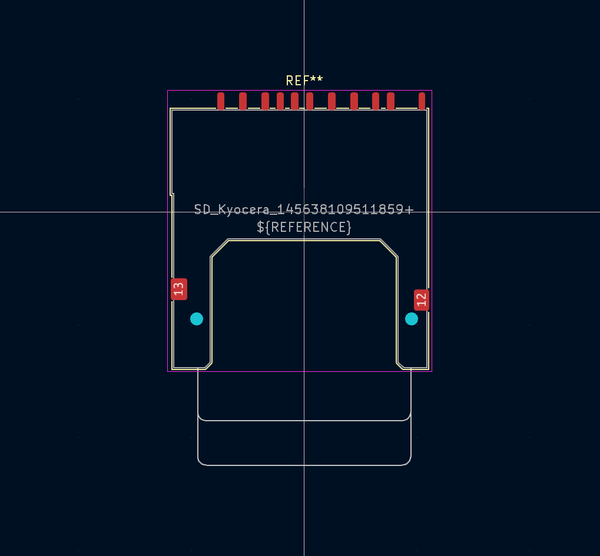
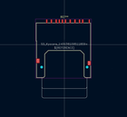
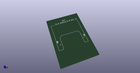
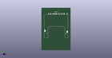

# OOMP Footprint  
## SD_Kyocera_145638109511859+  by Iangitpers  
  
oomp key: oomp_iangitpers_connector_card_sd_kyocera_145638109511859_  
  
source repo at: [http://github.com/Iangitpers/4a/blob/master/TYPE-C-31-M-12/HRO_TYPE-C-31-M-12.kicad_mod](http://github.com/Iangitpers/4a/blob/master/TYPE-C-31-M-12/HRO_TYPE-C-31-M-12.kicad_mod)  
## Footprint  
  
  
  
  
| name | value | 
| --- | --- | 
| footprint name | SD_Kyocera_145638109511859+ | 
| footprint description | SD Card Connector, Reverse Type, Outer Tail, Spring Eject Type (https://global.kyocera.com/prdct/electro/product/pdf/5638.pdf) | 
| number of pads | 15 | 
| github path | http://github.com/Iangitpers/4a/blob/master/Connector_Card.pretty/SD_Kyocera_145638109511859+.kicad_mod | 
| oomp key | oomp_iangitpers_connector_card_sd_kyocera_145638109511859_ | 
| oomp bot github | https://github.com/oomlout/oomlout_oomp_footprint_bot/tree/main/footprints/iangitpers_connector_card_sd_kyocera_145638109511859_/working | 
## Images  
  
  
  
  
  
  
  
  
