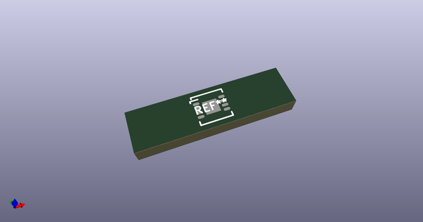
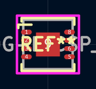
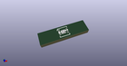

# OOMP Footprint  
## ANALOG-LFCSP_VD-8  by Iangitpers  
  
oomp key: oomp_iangitpers_manuf_analog_lfcsp_vd_8  
  
source repo at: [http://github.com/Iangitpers/4a/blob/master/TYPE-C-31-M-12/HRO_TYPE-C-31-M-12.kicad_mod](http://github.com/Iangitpers/4a/blob/master/TYPE-C-31-M-12/HRO_TYPE-C-31-M-12.kicad_mod)  
## Footprint  
  
  
  
  
| name | value | 
| --- | --- | 
| footprint name | ANALOG-LFCSP_VD-8 | 
| footprint description | PSON,0.50mm pitch;8 pin,4.10mm W X 3.00mm L X 0.80mm H body (pullback leads) (w/thermal tab) | 
| number of pads | 9 | 
| github path | http://github.com/Iangitpers/4a/blob/master/manuf.pretty/ANALOG-LFCSP_VD-8.kicad_mod | 
| oomp key | oomp_iangitpers_manuf_analog_lfcsp_vd_8 | 
| oomp bot github | https://github.com/oomlout/oomlout_oomp_footprint_bot/tree/main/footprints/iangitpers_manuf_analog_lfcsp_vd_8/working | 
## Images  
  
  
  
  
  
  
  
  
