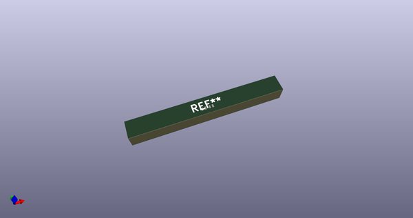
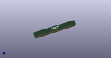

# OOMP Footprint  
## SEMTECH-SLP1508N5T  by Iangitpers  
  
oomp key: oomp_iangitpers_manuf_semtech_slp1508n5t  
  
source repo at: [http://github.com/Iangitpers/4a/blob/master/TYPE-C-31-M-12/HRO_TYPE-C-31-M-12.kicad_mod](http://github.com/Iangitpers/4a/blob/master/TYPE-C-31-M-12/HRO_TYPE-C-31-M-12.kicad_mod)  
## Footprint  
  
  
  
  
| name | value | 
| --- | --- | 
| footprint name | SEMTECH-SLP1508N5T | 
| footprint description | None | 
| number of pads | 5 | 
| github path | http://github.com/Iangitpers/4a/blob/master/manuf.pretty/SEMTECH-SLP1508N5T.kicad_mod | 
| oomp key | oomp_iangitpers_manuf_semtech_slp1508n5t | 
| oomp bot github | https://github.com/oomlout/oomlout_oomp_footprint_bot/tree/main/footprints/iangitpers_manuf_semtech_slp1508n5t/working | 
## Images  
  
  
  
  
  
  
  
  
