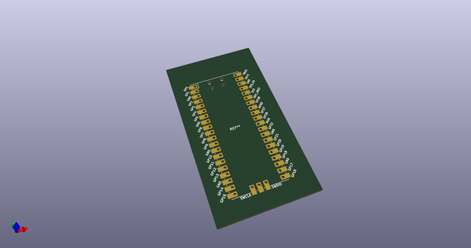
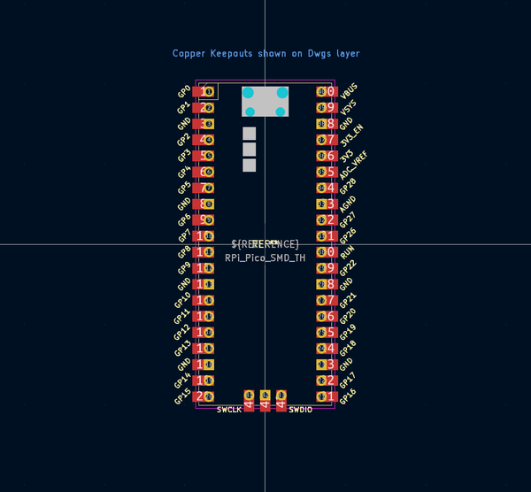
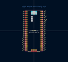
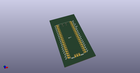
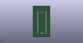
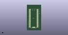

# OOMP Footprint  
## RPi_Pico_SMD_TH  by Iangitpers  
  
oomp key: oomp_iangitpers_mcu_raspberrypi_and_boards_rpi_pico_smd_th  
  
source repo at: [http://github.com/Iangitpers/4a/blob/master/TYPE-C-31-M-12/HRO_TYPE-C-31-M-12.kicad_mod](http://github.com/Iangitpers/4a/blob/master/TYPE-C-31-M-12/HRO_TYPE-C-31-M-12.kicad_mod)  
## Footprint  
  
  
  
  
| name | value | 
| --- | --- | 
| footprint name | RPi_Pico_SMD_TH | 
| footprint description | Through hole straight pin header, 2x20, 2.54mm pitch, double rows | 
| number of pads | 90 | 
| github path | http://github.com/Iangitpers/4a/blob/master/RP_Silicon_KiCad-main/KiCadLibraries/MCU_RaspberryPi_and_Boards.pretty/RPi_Pico_SMD_TH.kicad_mod | 
| oomp key | oomp_iangitpers_mcu_raspberrypi_and_boards_rpi_pico_smd_th | 
| oomp bot github | https://github.com/oomlout/oomlout_oomp_footprint_bot/tree/main/footprints/iangitpers_mcu_raspberrypi_and_boards_rpi_pico_smd_th/working | 
## Images  
  
  
  
  
  
  
  
  
