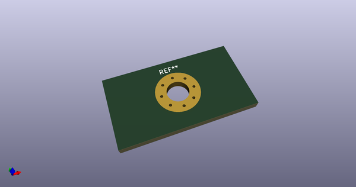
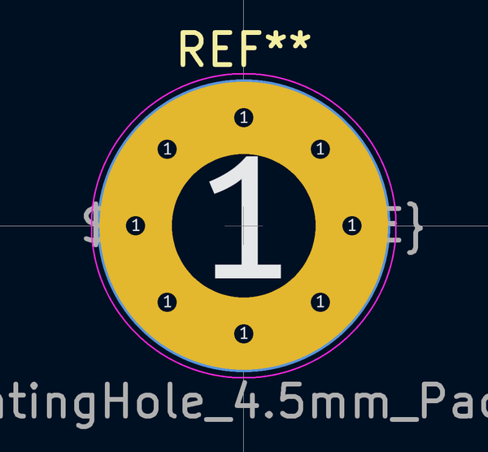
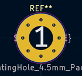
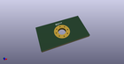

# OOMP Footprint  
## MountingHole_4.5mm_Pad_Via  by Iangitpers  
  
oomp key: oomp_iangitpers_mountinghole_mountinghole_4_5mm_pad_via  
  
source repo at: [http://github.com/Iangitpers/4a/blob/master/TYPE-C-31-M-12/HRO_TYPE-C-31-M-12.kicad_mod](http://github.com/Iangitpers/4a/blob/master/TYPE-C-31-M-12/HRO_TYPE-C-31-M-12.kicad_mod)  
## Footprint  
  
  
  
  
| name | value | 
| --- | --- | 
| footprint name | MountingHole_4.5mm_Pad_Via | 
| footprint description | Mounting Hole 4.5mm | 
| number of pads | 9 | 
| github path | http://github.com/Iangitpers/4a/blob/master/MountingHole.pretty/MountingHole_4.5mm_Pad_Via.kicad_mod | 
| oomp key | oomp_iangitpers_mountinghole_mountinghole_4_5mm_pad_via | 
| oomp bot github | https://github.com/oomlout/oomlout_oomp_footprint_bot/tree/main/footprints/iangitpers_mountinghole_mountinghole_4_5mm_pad_via/working | 
## Images  
  
  
  
  
  
  
  
  
