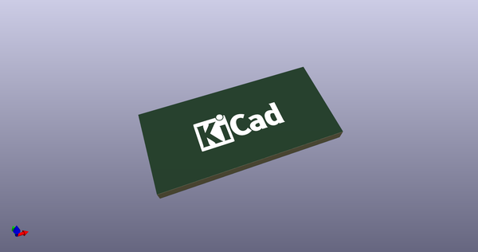
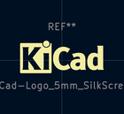

# OOMP Footprint  
## KiCad-Logo_5mm_SilkScreen  by Iangitpers  
  
oomp key: oomp_iangitpers_symbol_kicad_logo_5mm_silkscreen  
  
source repo at: [http://github.com/Iangitpers/4a/blob/master/TYPE-C-31-M-12/HRO_TYPE-C-31-M-12.kicad_mod](http://github.com/Iangitpers/4a/blob/master/TYPE-C-31-M-12/HRO_TYPE-C-31-M-12.kicad_mod)  
## Footprint  
  
  
  
  
| name | value | 
| --- | --- | 
| footprint name | KiCad-Logo_5mm_SilkScreen | 
| footprint description | KiCad Logo | 
| number of pads | 0 | 
| github path | http://github.com/Iangitpers/4a/blob/master/Symbol.pretty/KiCad-Logo_5mm_SilkScreen.kicad_mod | 
| oomp key | oomp_iangitpers_symbol_kicad_logo_5mm_silkscreen | 
| oomp bot github | https://github.com/oomlout/oomlout_oomp_footprint_bot/tree/main/footprints/iangitpers_symbol_kicad_logo_5mm_silkscreen/working | 
## Images  
  
  
  
  
  
  
  
  
