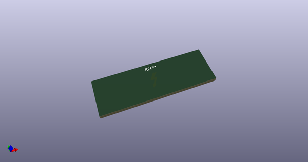
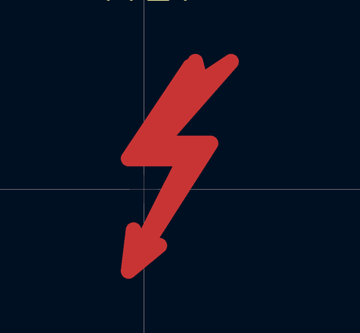
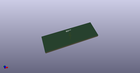

# OOMP Footprint  
## Symbol_Highvoltage_Type1_CopperTop_Small  by Iangitpers  
  
oomp key: oomp_iangitpers_symbol_symbol_highvoltage_type1_coppertop_small  
  
source repo at: [http://github.com/Iangitpers/4a/blob/master/TYPE-C-31-M-12/HRO_TYPE-C-31-M-12.kicad_mod](http://github.com/Iangitpers/4a/blob/master/TYPE-C-31-M-12/HRO_TYPE-C-31-M-12.kicad_mod)  
## Footprint  
  
  
  
  
| name | value | 
| --- | --- | 
| footprint name | Symbol_Highvoltage_Type1_CopperTop_Small | 
| footprint description | Symbol, Highvoltage, Type 1, Copper Top, Small, | 
| number of pads | 0 | 
| github path | http://github.com/Iangitpers/4a/blob/master/Symbol.pretty/Symbol_Highvoltage_Type1_CopperTop_Small.kicad_mod | 
| oomp key | oomp_iangitpers_symbol_symbol_highvoltage_type1_coppertop_small | 
| oomp bot github | https://github.com/oomlout/oomlout_oomp_footprint_bot/tree/main/footprints/iangitpers_symbol_symbol_highvoltage_type1_coppertop_small/working | 
## Images  
  
  
  
  
  
  
  
  
