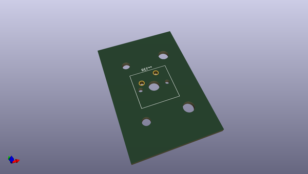
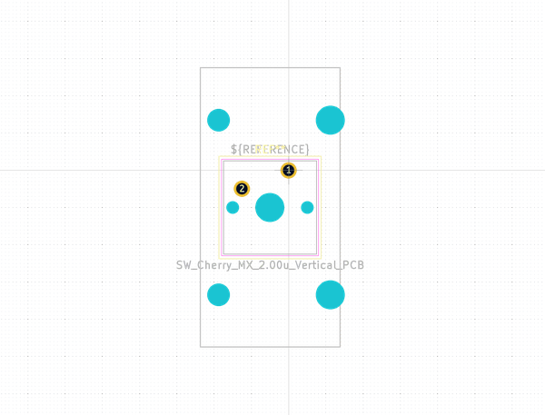

# OOMP Footprint  
## SW_Cherry_MX_2.00u_Vertical_PCB  by none  
  
oomp key: oomp_kicad_button_switch_keyboard_sw_cherry_mx_2_00u_vertical_pcb  
  
source repo at: [http://gitlab.com/kicad/libraries/kicad-footprints//blob/master/tmp/libraries/kicad-footprints/Varistor.pretty/RV_Rect_V25S440P_L26.5mm_W8.2mm_P12.7mm.kicad_mod](http://gitlab.com/kicad/libraries/kicad-footprints//blob/master/tmp/libraries/kicad-footprints/Varistor.pretty/RV_Rect_V25S440P_L26.5mm_W8.2mm_P12.7mm.kicad_mod)  
## Footprint  
  
  
  
  
| name | value | 
| --- | --- | 
| footprint name | SW_Cherry_MX_2.00u_Vertical_PCB | 
| footprint description | Cherry MX keyswitch, 2.00u, vertical, PCB mount, http://cherryamericas.com/wp-content/uploads/2014/12/mx_cat.pdf | 
| number of pads | 9 | 
| github path | http://github.com/kicad/libraries/kicad-footprints//blob/master/tmp/libraries/kicad-footprints/Button_Switch_Keyboard.pretty/SW_Cherry_MX_2.00u_Vertical_PCB.kicad_mod | 
| oomp key | oomp_kicad_button_switch_keyboard_sw_cherry_mx_2_00u_vertical_pcb | 
| oomp bot github | https://github.com/oomlout/oomlout_oomp_footprint_bot/tree/main/footprints/kicad_button_switch_keyboard_sw_cherry_mx_2_00u_vertical_pcb/working | 
## Images  
