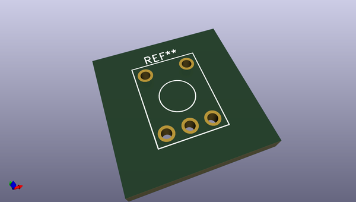
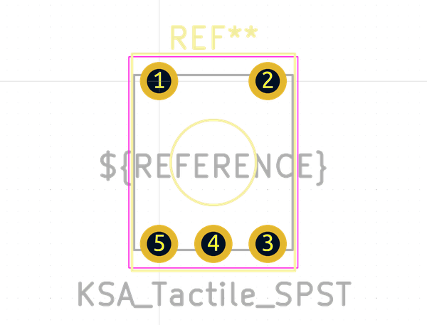

# OOMP Footprint  
## KSA_Tactile_SPST  by none  
  
oomp key: oomp_kicad_button_switch_tht_ksa_tactile_spst  
  
source repo at: [http://gitlab.com/kicad/libraries/kicad-footprints//blob/master/tmp/libraries/kicad-footprints/Varistor.pretty/RV_Rect_V25S440P_L26.5mm_W8.2mm_P12.7mm.kicad_mod](http://gitlab.com/kicad/libraries/kicad-footprints//blob/master/tmp/libraries/kicad-footprints/Varistor.pretty/RV_Rect_V25S440P_L26.5mm_W8.2mm_P12.7mm.kicad_mod)  
## Footprint  
  
  
  
  
| name | value | 
| --- | --- | 
| footprint name | KSA_Tactile_SPST | 
| footprint description | KSA http://www.ckswitches.com/media/1457/ksa_ksl.pdf | 
| number of pads | 5 | 
| github path | http://github.com/kicad/libraries/kicad-footprints//blob/master/tmp/libraries/kicad-footprints/Button_Switch_THT.pretty/KSA_Tactile_SPST.kicad_mod | 
| oomp key | oomp_kicad_button_switch_tht_ksa_tactile_spst | 
| oomp bot github | https://github.com/oomlout/oomlout_oomp_footprint_bot/tree/main/footprints/kicad_button_switch_tht_ksa_tactile_spst/working | 
## Images  
