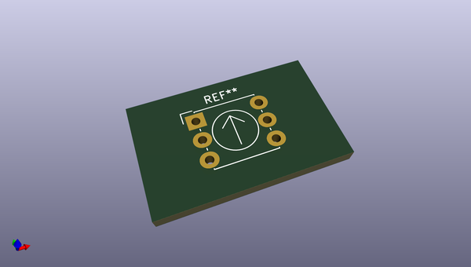
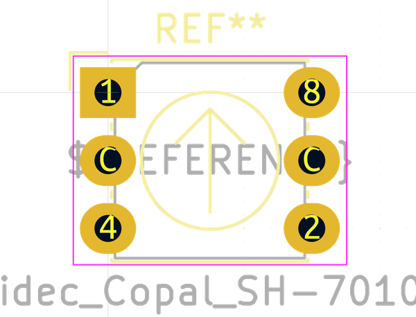

# OOMP Footprint  
## Nidec_Copal_SH-7010C  by none  
  
oomp key: oomp_kicad_button_switch_tht_nidec_copal_sh_7010c  
  
source repo at: [http://gitlab.com/kicad/libraries/kicad-footprints//blob/master/tmp/libraries/kicad-footprints/Varistor.pretty/RV_Rect_V25S440P_L26.5mm_W8.2mm_P12.7mm.kicad_mod](http://gitlab.com/kicad/libraries/kicad-footprints//blob/master/tmp/libraries/kicad-footprints/Varistor.pretty/RV_Rect_V25S440P_L26.5mm_W8.2mm_P12.7mm.kicad_mod)  
## Footprint  
  
  
  
  
| name | value | 
| --- | --- | 
| footprint name | Nidec_Copal_SH-7010C | 
| footprint description | 4-bit rotary coded switch, through-hole, https://www.nidec-copal-electronics.com/e/catalog/switch/sh-7000.pdf | 
| number of pads | 6 | 
| github path | http://github.com/kicad/libraries/kicad-footprints//blob/master/tmp/libraries/kicad-footprints/Button_Switch_THT.pretty/Nidec_Copal_SH-7010C.kicad_mod | 
| oomp key | oomp_kicad_button_switch_tht_nidec_copal_sh_7010c | 
| oomp bot github | https://github.com/oomlout/oomlout_oomp_footprint_bot/tree/main/footprints/kicad_button_switch_tht_nidec_copal_sh_7010c/working | 
## Images  
