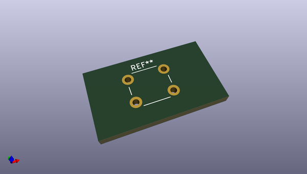
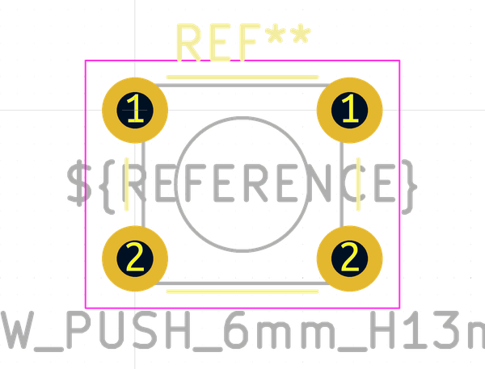

# OOMP Footprint  
## SW_PUSH_6mm_H13mm  by none  
  
oomp key: oomp_kicad_button_switch_tht_sw_push_6mm_h13mm  
  
source repo at: [http://gitlab.com/kicad/libraries/kicad-footprints//blob/master/tmp/libraries/kicad-footprints/Varistor.pretty/RV_Rect_V25S440P_L26.5mm_W8.2mm_P12.7mm.kicad_mod](http://gitlab.com/kicad/libraries/kicad-footprints//blob/master/tmp/libraries/kicad-footprints/Varistor.pretty/RV_Rect_V25S440P_L26.5mm_W8.2mm_P12.7mm.kicad_mod)  
## Footprint  
  
  
  
  
| name | value | 
| --- | --- | 
| footprint name | SW_PUSH_6mm_H13mm | 
| footprint description | tactile push button, 6x6mm e.g. PHAP33xx series, height=13mm | 
| number of pads | 4 | 
| github path | http://github.com/kicad/libraries/kicad-footprints//blob/master/tmp/libraries/kicad-footprints/Button_Switch_THT.pretty/SW_PUSH_6mm_H13mm.kicad_mod | 
| oomp key | oomp_kicad_button_switch_tht_sw_push_6mm_h13mm | 
| oomp bot github | https://github.com/oomlout/oomlout_oomp_footprint_bot/tree/main/footprints/kicad_button_switch_tht_sw_push_6mm_h13mm/working | 
## Images  
