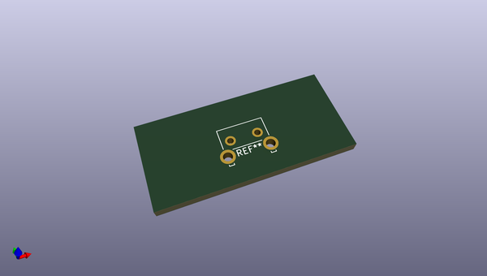
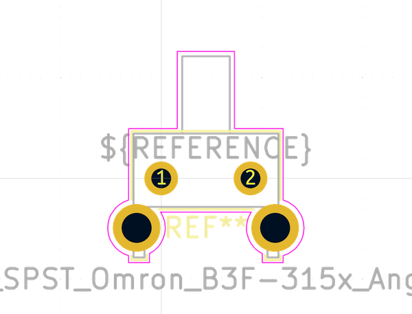

# OOMP Footprint  
## SW_SPST_Omron_B3F-315x_Angled  by none  
  
oomp key: oomp_kicad_button_switch_tht_sw_spst_omron_b3f_315x_angled  
  
source repo at: [http://gitlab.com/kicad/libraries/kicad-footprints//blob/master/tmp/libraries/kicad-footprints/Varistor.pretty/RV_Rect_V25S440P_L26.5mm_W8.2mm_P12.7mm.kicad_mod](http://gitlab.com/kicad/libraries/kicad-footprints//blob/master/tmp/libraries/kicad-footprints/Varistor.pretty/RV_Rect_V25S440P_L26.5mm_W8.2mm_P12.7mm.kicad_mod)  
## Footprint  
  
  
  
  
| name | value | 
| --- | --- | 
| footprint name | SW_SPST_Omron_B3F-315x_Angled | 
| footprint description | tactile switch, 7.3mm x 6.25mm  x 7.4mm, right angle, https://omronfs.omron.com/en_US/ecb/products/pdf/en-b3f.pdf | 
| number of pads | 4 | 
| github path | http://github.com/kicad/libraries/kicad-footprints//blob/master/tmp/libraries/kicad-footprints/Button_Switch_THT.pretty/SW_SPST_Omron_B3F-315x_Angled.kicad_mod | 
| oomp key | oomp_kicad_button_switch_tht_sw_spst_omron_b3f_315x_angled | 
| oomp bot github | https://github.com/oomlout/oomlout_oomp_footprint_bot/tree/main/footprints/kicad_button_switch_tht_sw_spst_omron_b3f_315x_angled/working | 
## Images  
