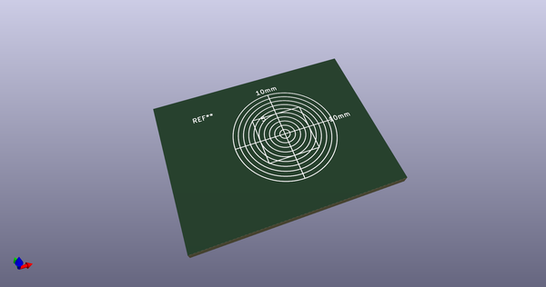
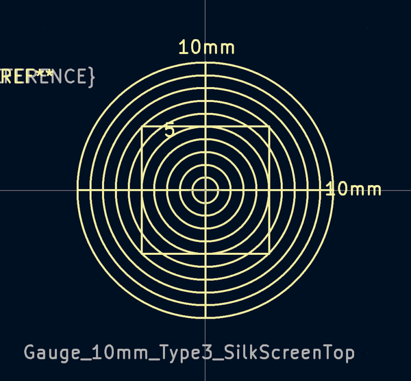
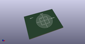

# OOMP Footprint  
## Gauge_10mm_Type3_SilkScreenTop  by none  
  
oomp key: oomp_kicad_calibration_scale_gauge_10mm_type3_silkscreentop  
  
source repo at: [http://gitlab.com/kicad/libraries/kicad-footprints//blob/master/tmp/libraries/kicad-footprints/Varistor.pretty/RV_Rect_V25S440P_L26.5mm_W8.2mm_P12.7mm.kicad_mod](http://gitlab.com/kicad/libraries/kicad-footprints//blob/master/tmp/libraries/kicad-footprints/Varistor.pretty/RV_Rect_V25S440P_L26.5mm_W8.2mm_P12.7mm.kicad_mod)  
## Footprint  
  
  
  
  
| name | value | 
| --- | --- | 
| footprint name | Gauge_10mm_Type3_SilkScreenTop | 
| footprint description | Gauge, Massstab, 10mm, SilkScreenTop, Type 3, | 
| number of pads | 0 | 
| github path | http://github.com/kicad/libraries/kicad-footprints//blob/master/tmp/libraries/kicad-footprints/Calibration_Scale.pretty/Gauge_10mm_Type3_SilkScreenTop.kicad_mod | 
| oomp key | oomp_kicad_calibration_scale_gauge_10mm_type3_silkscreentop | 
| oomp bot github | https://github.com/oomlout/oomlout_oomp_footprint_bot/tree/main/footprints/kicad_calibration_scale_gauge_10mm_type3_silkscreentop/working | 
## Images  
  
  
  
  
  
  
  
  
