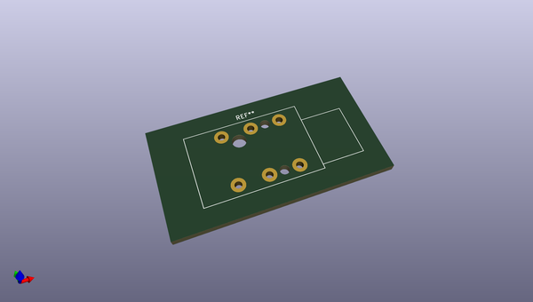
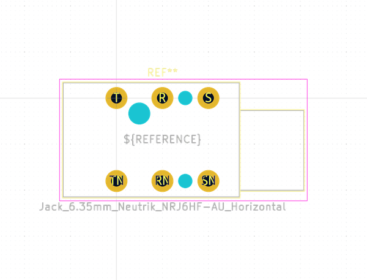

# OOMP Footprint  
## Jack_6.35mm_Neutrik_NRJ6HF-AU_Horizontal  by none  
  
oomp key: oomp_kicad_connector_audio_jack_6_35mm_neutrik_nrj6hf_au_horizontal  
  
source repo at: [http://gitlab.com/kicad/libraries/kicad-footprints//blob/master/tmp/libraries/kicad-footprints/Varistor.pretty/RV_Rect_V25S440P_L26.5mm_W8.2mm_P12.7mm.kicad_mod](http://gitlab.com/kicad/libraries/kicad-footprints//blob/master/tmp/libraries/kicad-footprints/Varistor.pretty/RV_Rect_V25S440P_L26.5mm_W8.2mm_P12.7mm.kicad_mod)  
## Footprint  
  
  
  
  
| name | value | 
| --- | --- | 
| footprint name | Jack_6.35mm_Neutrik_NRJ6HF-AU_Horizontal | 
| footprint description | Slim Jacks, 6.35mm (1/4in) stereo jack, switched, gold plated contacts, fully threaded nose, https://www.neutrik.com/en/product/nrj6hf-au | 
| number of pads | 9 | 
| github path | http://github.com/kicad/libraries/kicad-footprints//blob/master/tmp/libraries/kicad-footprints/Connector_Audio.pretty/Jack_6.35mm_Neutrik_NRJ6HF-AU_Horizontal.kicad_mod | 
| oomp key | oomp_kicad_connector_audio_jack_6_35mm_neutrik_nrj6hf_au_horizontal | 
| oomp bot github | https://github.com/oomlout/oomlout_oomp_footprint_bot/tree/main/footprints/kicad_connector_audio_jack_6_35mm_neutrik_nrj6hf_au_horizontal/working | 
## Images  
