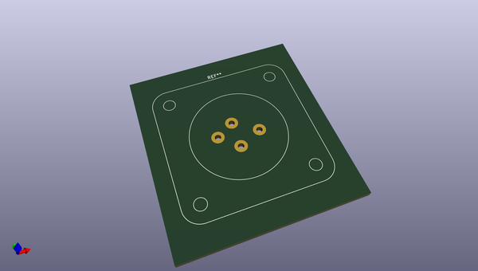
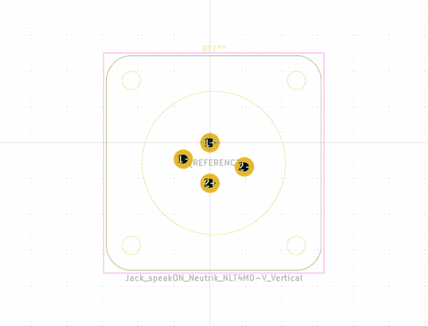

# OOMP Footprint  
## Jack_speakON_Neutrik_NLT4MD-V_Vertical  by none  
  
oomp key: oomp_kicad_connector_audio_jack_speakon_neutrik_nlt4md_v_vertical  
  
source repo at: [http://gitlab.com/kicad/libraries/kicad-footprints//blob/master/tmp/libraries/kicad-footprints/Varistor.pretty/RV_Rect_V25S440P_L26.5mm_W8.2mm_P12.7mm.kicad_mod](http://gitlab.com/kicad/libraries/kicad-footprints//blob/master/tmp/libraries/kicad-footprints/Varistor.pretty/RV_Rect_V25S440P_L26.5mm_W8.2mm_P12.7mm.kicad_mod)  
## Footprint  
  
  
  
  
| name | value | 
| --- | --- | 
| footprint name | Jack_speakON_Neutrik_NLT4MD-V_Vertical | 
| footprint description | STX Series, 4 pole male chassis connector, metal housing, vertical PCB mount,  self tapping screw holes (A-screw), https://www.neutrik.com/en/product/nlt4md-v | 
| number of pads | 4 | 
| github path | http://github.com/kicad/libraries/kicad-footprints//blob/master/tmp/libraries/kicad-footprints/Connector_Audio.pretty/Jack_speakON_Neutrik_NLT4MD-V_Vertical.kicad_mod | 
| oomp key | oomp_kicad_connector_audio_jack_speakon_neutrik_nlt4md_v_vertical | 
| oomp bot github | https://github.com/oomlout/oomlout_oomp_footprint_bot/tree/main/footprints/kicad_connector_audio_jack_speakon_neutrik_nlt4md_v_vertical/working | 
## Images  
