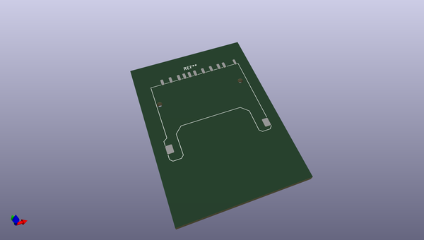
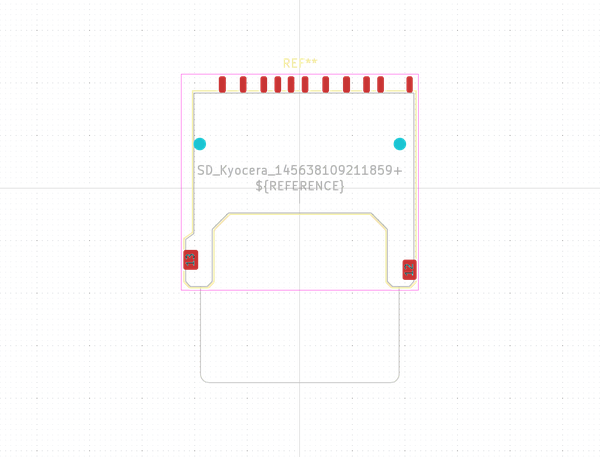

# OOMP Footprint  
## SD_Kyocera_145638109211859+  by none  
  
oomp key: oomp_kicad_connector_card_sd_kyocera_145638109211859_  
  
source repo at: [http://gitlab.com/kicad/libraries/kicad-footprints//blob/master/tmp/libraries/kicad-footprints/Varistor.pretty/RV_Rect_V25S440P_L26.5mm_W8.2mm_P12.7mm.kicad_mod](http://gitlab.com/kicad/libraries/kicad-footprints//blob/master/tmp/libraries/kicad-footprints/Varistor.pretty/RV_Rect_V25S440P_L26.5mm_W8.2mm_P12.7mm.kicad_mod)  
## Footprint  
  
  
  
  
| name | value | 
| --- | --- | 
| footprint name | SD_Kyocera_145638109211859+ | 
| footprint description | SD Card Connector, Reverse Type, Outer Tail, Without Ejector (https://global.kyocera.com/prdct/electro/product/pdf/5638.pdf) | 
| number of pads | 15 | 
| github path | http://github.com/kicad/libraries/kicad-footprints//blob/master/tmp/libraries/kicad-footprints/Connector_Card.pretty/SD_Kyocera_145638109211859+.kicad_mod | 
| oomp key | oomp_kicad_connector_card_sd_kyocera_145638109211859_ | 
| oomp bot github | https://github.com/oomlout/oomlout_oomp_footprint_bot/tree/main/footprints/kicad_connector_card_sd_kyocera_145638109211859_/working | 
## Images  
