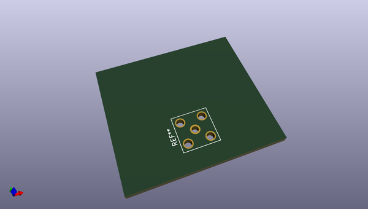
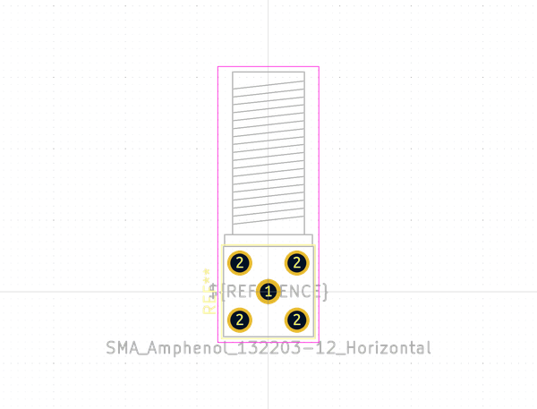

# OOMP Footprint  
## SMA_Amphenol_132203-12_Horizontal  by none  
  
oomp key: oomp_kicad_connector_coaxial_sma_amphenol_132203_12_horizontal  
  
source repo at: [http://gitlab.com/kicad/libraries/kicad-footprints//blob/master/tmp/libraries/kicad-footprints/Varistor.pretty/RV_Rect_V25S440P_L26.5mm_W8.2mm_P12.7mm.kicad_mod](http://gitlab.com/kicad/libraries/kicad-footprints//blob/master/tmp/libraries/kicad-footprints/Varistor.pretty/RV_Rect_V25S440P_L26.5mm_W8.2mm_P12.7mm.kicad_mod)  
## Footprint  
  
  
  
  
| name | value | 
| --- | --- | 
| footprint name | SMA_Amphenol_132203-12_Horizontal | 
| footprint description | https://www.amphenolrf.com/media/downloads/1769/132203-12.pdf | 
| number of pads | 5 | 
| github path | http://github.com/kicad/libraries/kicad-footprints//blob/master/tmp/libraries/kicad-footprints/Connector_Coaxial.pretty/SMA_Amphenol_132203-12_Horizontal.kicad_mod | 
| oomp key | oomp_kicad_connector_coaxial_sma_amphenol_132203_12_horizontal | 
| oomp bot github | https://github.com/oomlout/oomlout_oomp_footprint_bot/tree/main/footprints/kicad_connector_coaxial_sma_amphenol_132203_12_horizontal/working | 
## Images  
