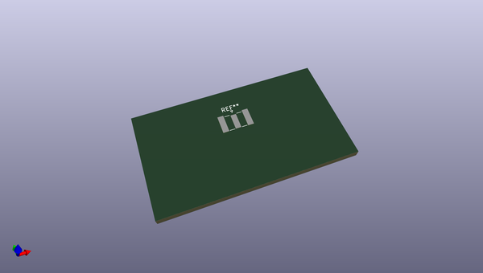
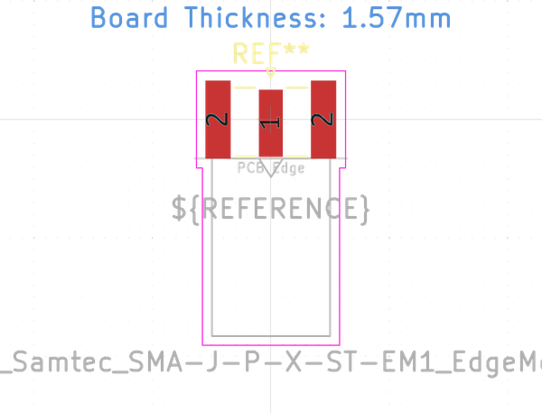

# OOMP Footprint  
## SMA_Samtec_SMA-J-P-X-ST-EM1_EdgeMount  by none  
  
oomp key: oomp_kicad_connector_coaxial_sma_samtec_sma_j_p_x_st_em1_edgemount  
  
source repo at: [http://gitlab.com/kicad/libraries/kicad-footprints//blob/master/tmp/libraries/kicad-footprints/Varistor.pretty/RV_Rect_V25S440P_L26.5mm_W8.2mm_P12.7mm.kicad_mod](http://gitlab.com/kicad/libraries/kicad-footprints//blob/master/tmp/libraries/kicad-footprints/Varistor.pretty/RV_Rect_V25S440P_L26.5mm_W8.2mm_P12.7mm.kicad_mod)  
## Footprint  
  
  
  
  
| name | value | 
| --- | --- | 
| footprint name | SMA_Samtec_SMA-J-P-X-ST-EM1_EdgeMount | 
| footprint description | Connector SMA, 0Hz to 20GHz, 50Ohm, Edge Mount (http://suddendocs.samtec.com/prints/sma-j-p-x-st-em1-mkt.pdf) | 
| number of pads | 5 | 
| github path | http://github.com/kicad/libraries/kicad-footprints//blob/master/tmp/libraries/kicad-footprints/Connector_Coaxial.pretty/SMA_Samtec_SMA-J-P-X-ST-EM1_EdgeMount.kicad_mod | 
| oomp key | oomp_kicad_connector_coaxial_sma_samtec_sma_j_p_x_st_em1_edgemount | 
| oomp bot github | https://github.com/oomlout/oomlout_oomp_footprint_bot/tree/main/footprints/kicad_connector_coaxial_sma_samtec_sma_j_p_x_st_em1_edgemount/working | 
## Images  
