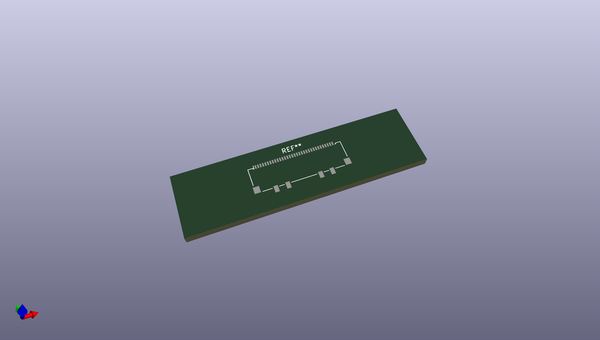
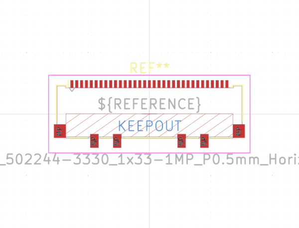

# OOMP Footprint  
## Molex_502244-3330_1x33-1MP_P0.5mm_Horizontal  by none  
  
oomp key: oomp_kicad_connector_ffc_fpc_molex_502244_3330_1x33_1mp_p0_5mm_horizontal  
  
source repo at: [http://gitlab.com/kicad/libraries/kicad-footprints//blob/master/tmp/libraries/kicad-footprints/Varistor.pretty/RV_Rect_V25S440P_L26.5mm_W8.2mm_P12.7mm.kicad_mod](http://gitlab.com/kicad/libraries/kicad-footprints//blob/master/tmp/libraries/kicad-footprints/Varistor.pretty/RV_Rect_V25S440P_L26.5mm_W8.2mm_P12.7mm.kicad_mod)  
## Footprint  
  
  
  
  
| name | value | 
| --- | --- | 
| footprint name | Molex_502244-3330_1x33-1MP_P0.5mm_Horizontal | 
| footprint description | Molex 0.50mm Pitch Easy-On Type FFC/FPC Connector, For LVDS, 2.33mm Height, Right Angle, Surface Mount, ZIF, Bottom Contact Style, 33 Circuits (http://www.molex.com/pdm_docs/sd/5022441530_sd.pdf) | 
| number of pads | 39 | 
| github path | http://github.com/kicad/libraries/kicad-footprints//blob/master/tmp/libraries/kicad-footprints/Connector_FFC-FPC.pretty/Molex_502244-3330_1x33-1MP_P0.5mm_Horizontal.kicad_mod | 
| oomp key | oomp_kicad_connector_ffc_fpc_molex_502244_3330_1x33_1mp_p0_5mm_horizontal | 
| oomp bot github | https://github.com/oomlout/oomlout_oomp_footprint_bot/tree/main/footprints/kicad_connector_ffc_fpc_molex_502244_3330_1x33_1mp_p0_5mm_horizontal/working | 
## Images  
