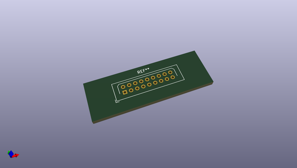
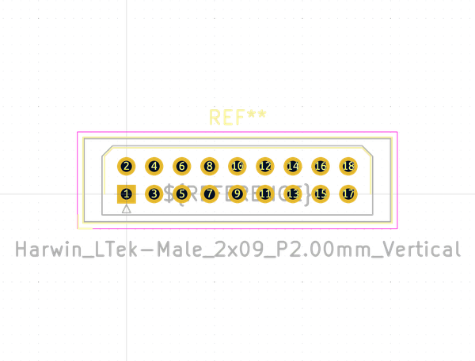

# OOMP Footprint  
## Harwin_LTek-Male_2x09_P2.00mm_Vertical  by none  
  
oomp key: oomp_kicad_connector_harwin_harwin_ltek_male_2x09_p2_00mm_vertical  
  
source repo at: [http://gitlab.com/kicad/libraries/kicad-footprints//blob/master/tmp/libraries/kicad-footprints/Varistor.pretty/RV_Rect_V25S440P_L26.5mm_W8.2mm_P12.7mm.kicad_mod](http://gitlab.com/kicad/libraries/kicad-footprints//blob/master/tmp/libraries/kicad-footprints/Varistor.pretty/RV_Rect_V25S440P_L26.5mm_W8.2mm_P12.7mm.kicad_mod)  
## Footprint  
  
  
  
  
| name | value | 
| --- | --- | 
| footprint name | Harwin_LTek-Male_2x09_P2.00mm_Vertical | 
| footprint description | Harwin LTek Connector, 18 pins, single row male, vertical entry | 
| number of pads | 18 | 
| github path | http://github.com/kicad/libraries/kicad-footprints//blob/master/tmp/libraries/kicad-footprints/Connector_Harwin.pretty/Harwin_LTek-Male_2x09_P2.00mm_Vertical.kicad_mod | 
| oomp key | oomp_kicad_connector_harwin_harwin_ltek_male_2x09_p2_00mm_vertical | 
| oomp bot github | https://github.com/oomlout/oomlout_oomp_footprint_bot/tree/main/footprints/kicad_connector_harwin_harwin_ltek_male_2x09_p2_00mm_vertical/working | 
## Images  
