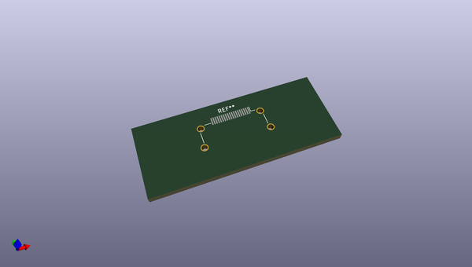
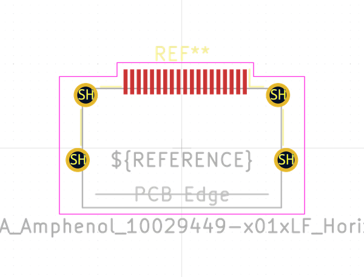

# OOMP Footprint  
## HDMI_A_Amphenol_10029449-x01xLF_Horizontal  by none  
  
oomp key: oomp_kicad_connector_hdmi_hdmi_a_amphenol_10029449_x01xlf_horizontal  
  
source repo at: [http://gitlab.com/kicad/libraries/kicad-footprints//blob/master/tmp/libraries/kicad-footprints/Varistor.pretty/RV_Rect_V25S440P_L26.5mm_W8.2mm_P12.7mm.kicad_mod](http://gitlab.com/kicad/libraries/kicad-footprints//blob/master/tmp/libraries/kicad-footprints/Varistor.pretty/RV_Rect_V25S440P_L26.5mm_W8.2mm_P12.7mm.kicad_mod)  
## Footprint  
  
  
  
  
| name | value | 
| --- | --- | 
| footprint name | HDMI_A_Amphenol_10029449-x01xLF_Horizontal | 
| footprint description | HDMI Type A connector, Amphenol 10029449-001TLF 10029449-001RLF 10029449-101TLF 10029449-101RLF, Right Angle(https://cdn.amphenol-icc.com/media/wysiwyg/files/drawing/10029449.pdf) | 
| number of pads | 23 | 
| github path | http://github.com/kicad/libraries/kicad-footprints//blob/master/tmp/libraries/kicad-footprints/Connector_HDMI.pretty/HDMI_A_Amphenol_10029449-x01xLF_Horizontal.kicad_mod | 
| oomp key | oomp_kicad_connector_hdmi_hdmi_a_amphenol_10029449_x01xlf_horizontal | 
| oomp bot github | https://github.com/oomlout/oomlout_oomp_footprint_bot/tree/main/footprints/kicad_connector_hdmi_hdmi_a_amphenol_10029449_x01xlf_horizontal/working | 
## Images  
