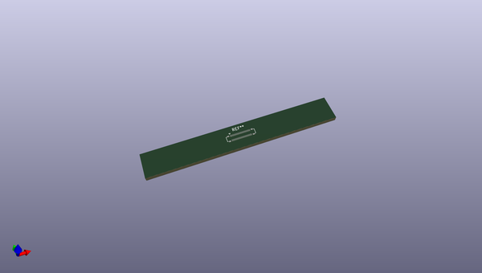
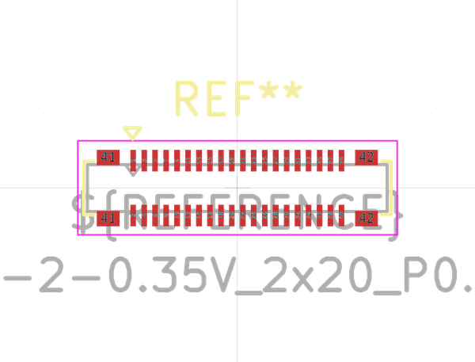

# OOMP Footprint  
## Hirose_BM24_BM24-40DP-2-0.35V_2x20_P0.35mm_PowerPin2_Vertical  by none  
  
oomp key: oomp_kicad_connector_hirose_hirose_bm24_bm24_40dp_2_0_35v_2x20_p0_35mm_powerpin2_vertical  
  
source repo at: [http://gitlab.com/kicad/libraries/kicad-footprints//blob/master/tmp/libraries/kicad-footprints/Varistor.pretty/RV_Rect_V25S440P_L26.5mm_W8.2mm_P12.7mm.kicad_mod](http://gitlab.com/kicad/libraries/kicad-footprints//blob/master/tmp/libraries/kicad-footprints/Varistor.pretty/RV_Rect_V25S440P_L26.5mm_W8.2mm_P12.7mm.kicad_mod)  
## Footprint  
  
  
  
  
| name | value | 
| --- | --- | 
| footprint name | Hirose_BM24_BM24-40DP-2-0.35V_2x20_P0.35mm_PowerPin2_Vertical | 
| footprint description | Hirose BM24 series connector, BM24-40DP/2-0.35V (https://www.hirose.com/product/en/download_file/key_name/BM24/category/Catalog/doc_file_id/47680/?file_category_id=4&item_id=50&is_series=1) | 
| number of pads | 44 | 
| github path | http://github.com/kicad/libraries/kicad-footprints//blob/master/tmp/libraries/kicad-footprints/Connector_Hirose.pretty/Hirose_BM24_BM24-40DP-2-0.35V_2x20_P0.35mm_PowerPin2_Vertical.kicad_mod | 
| oomp key | oomp_kicad_connector_hirose_hirose_bm24_bm24_40dp_2_0_35v_2x20_p0_35mm_powerpin2_vertical | 
| oomp bot github | https://github.com/oomlout/oomlout_oomp_footprint_bot/tree/main/footprints/kicad_connector_hirose_hirose_bm24_bm24_40dp_2_0_35v_2x20_p0_35mm_powerpin2_vertical/working | 
## Images  
