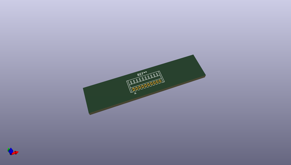
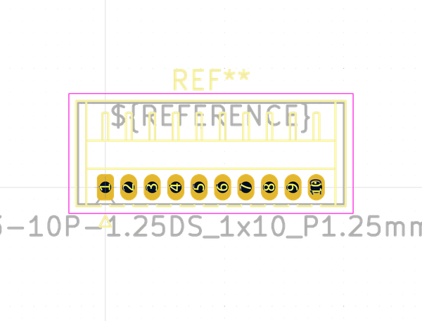

# OOMP Footprint  
## Hirose_DF13-10P-1.25DS_1x10_P1.25mm_Horizontal  by none  
  
oomp key: oomp_kicad_connector_hirose_hirose_df13_10p_1_25ds_1x10_p1_25mm_horizontal  
  
source repo at: [http://gitlab.com/kicad/libraries/kicad-footprints//blob/master/tmp/libraries/kicad-footprints/Varistor.pretty/RV_Rect_V25S440P_L26.5mm_W8.2mm_P12.7mm.kicad_mod](http://gitlab.com/kicad/libraries/kicad-footprints//blob/master/tmp/libraries/kicad-footprints/Varistor.pretty/RV_Rect_V25S440P_L26.5mm_W8.2mm_P12.7mm.kicad_mod)  
## Footprint  
  
  
  
  
| name | value | 
| --- | --- | 
| footprint name | Hirose_DF13-10P-1.25DS_1x10_P1.25mm_Horizontal | 
| footprint description | Hirose DF13 through hole, DF13-10P-1.25DS, 10 Pins per row (https://www.hirose.com/product/en/products/DF13/DF13-4P-1.25DS%2820%29/), generated with kicad-footprint-generator | 
| number of pads | 10 | 
| github path | http://github.com/kicad/libraries/kicad-footprints//blob/master/tmp/libraries/kicad-footprints/Connector_Hirose.pretty/Hirose_DF13-10P-1.25DS_1x10_P1.25mm_Horizontal.kicad_mod | 
| oomp key | oomp_kicad_connector_hirose_hirose_df13_10p_1_25ds_1x10_p1_25mm_horizontal | 
| oomp bot github | https://github.com/oomlout/oomlout_oomp_footprint_bot/tree/main/footprints/kicad_connector_hirose_hirose_df13_10p_1_25ds_1x10_p1_25mm_horizontal/working | 
## Images  
