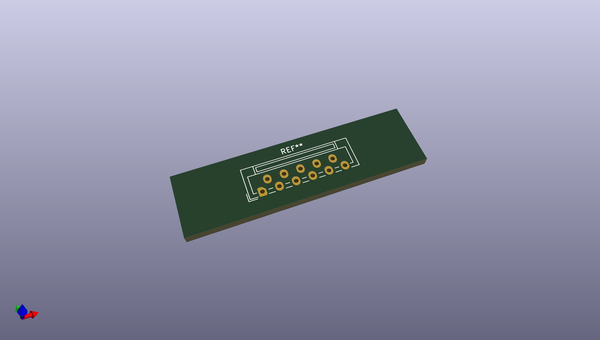
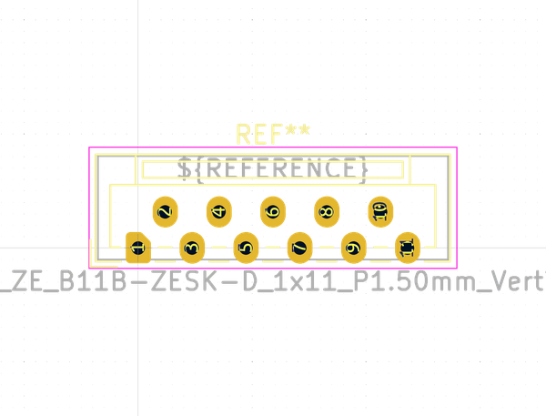

# OOMP Footprint  
## JST_ZE_B11B-ZESK-D_1x11_P1.50mm_Vertical  by none  
  
oomp key: oomp_kicad_connector_jst_jst_ze_b11b_zesk_d_1x11_p1_50mm_vertical  
  
source repo at: [http://gitlab.com/kicad/libraries/kicad-footprints//blob/master/tmp/libraries/kicad-footprints/Varistor.pretty/RV_Rect_V25S440P_L26.5mm_W8.2mm_P12.7mm.kicad_mod](http://gitlab.com/kicad/libraries/kicad-footprints//blob/master/tmp/libraries/kicad-footprints/Varistor.pretty/RV_Rect_V25S440P_L26.5mm_W8.2mm_P12.7mm.kicad_mod)  
## Footprint  
  
  
  
  
| name | value | 
| --- | --- | 
| footprint name | JST_ZE_B11B-ZESK-D_1x11_P1.50mm_Vertical | 
| footprint description | JST ZE series connector, B11B-ZESK-D (http://www.jst-mfg.com/product/pdf/eng/eZE.pdf), generated with kicad-footprint-generator | 
| number of pads | 11 | 
| github path | http://github.com/kicad/libraries/kicad-footprints//blob/master/tmp/libraries/kicad-footprints/Connector_JST.pretty/JST_ZE_B11B-ZESK-D_1x11_P1.50mm_Vertical.kicad_mod | 
| oomp key | oomp_kicad_connector_jst_jst_ze_b11b_zesk_d_1x11_p1_50mm_vertical | 
| oomp bot github | https://github.com/oomlout/oomlout_oomp_footprint_bot/tree/main/footprints/kicad_connector_jst_jst_ze_b11b_zesk_d_1x11_p1_50mm_vertical/working | 
## Images  
