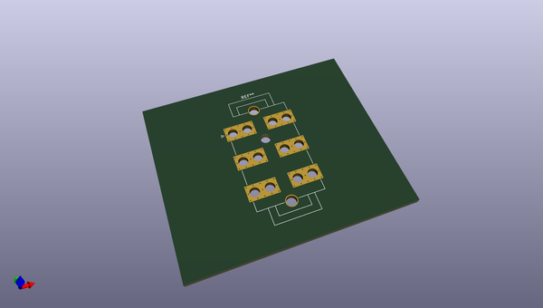
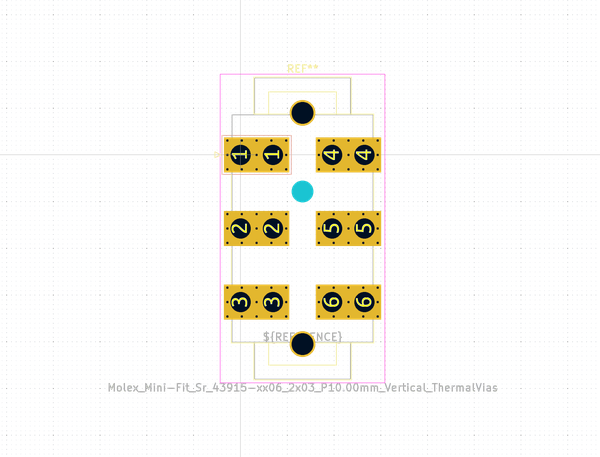

# OOMP Footprint  
## Molex_Mini-Fit_Sr_43915-xx06_2x03_P10.00mm_Vertical_ThermalVias  by none  
  
oomp key: oomp_kicad_connector_molex_molex_mini_fit_sr_43915_xx06_2x03_p10_00mm_vertical_thermalvias  
  
source repo at: [http://gitlab.com/kicad/libraries/kicad-footprints//blob/master/tmp/libraries/kicad-footprints/Varistor.pretty/RV_Rect_V25S440P_L26.5mm_W8.2mm_P12.7mm.kicad_mod](http://gitlab.com/kicad/libraries/kicad-footprints//blob/master/tmp/libraries/kicad-footprints/Varistor.pretty/RV_Rect_V25S440P_L26.5mm_W8.2mm_P12.7mm.kicad_mod)  
## Footprint  
  
  
  
  
| name | value | 
| --- | --- | 
| footprint name | Molex_Mini-Fit_Sr_43915-xx06_2x03_P10.00mm_Vertical_ThermalVias | 
| footprint description | Molex Mini-Fit Sr. Power Connectors, 43915-xx06, With thermal vias in pads, 3 Pins per row (http://www.molex.com/pdm_docs/sd/439151404_sd.pdf), generated with kicad-footprint-generator | 
| number of pads | 93 | 
| github path | http://github.com/kicad/libraries/kicad-footprints//blob/master/tmp/libraries/kicad-footprints/Connector_Molex.pretty/Molex_Mini-Fit_Sr_43915-xx06_2x03_P10.00mm_Vertical_ThermalVias.kicad_mod | 
| oomp key | oomp_kicad_connector_molex_molex_mini_fit_sr_43915_xx06_2x03_p10_00mm_vertical_thermalvias | 
| oomp bot github | https://github.com/oomlout/oomlout_oomp_footprint_bot/tree/main/footprints/kicad_connector_molex_molex_mini_fit_sr_43915_xx06_2x03_p10_00mm_vertical_thermalvias/working | 
## Images  
