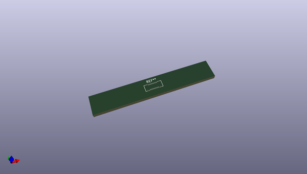

# OOMP Footprint  
## Molex_SlimStack_502426-2010_2x10_P0.40mm_Vertical  by none  
  
oomp key: oomp_kicad_connector_molex_molex_slimstack_502426_2010_2x10_p0_40mm_vertical  
  
source repo at: [http://gitlab.com/kicad/libraries/kicad-footprints//blob/master/tmp/libraries/kicad-footprints/Varistor.pretty/RV_Rect_V25S440P_L26.5mm_W8.2mm_P12.7mm.kicad_mod](http://gitlab.com/kicad/libraries/kicad-footprints//blob/master/tmp/libraries/kicad-footprints/Varistor.pretty/RV_Rect_V25S440P_L26.5mm_W8.2mm_P12.7mm.kicad_mod)  
## Footprint  
  
  
  
  
| name | value | 
| --- | --- | 
| footprint name | Molex_SlimStack_502426-2010_2x10_P0.40mm_Vertical | 
| footprint description | Molex SlimStack Fine-Pitch SMT Board-to-Board Connectors, 502426-2010, 20 Pins (http://www.molex.com/pdm_docs/sd/5024260810_sd.pdf), generated with kicad-footprint-generator | 
| number of pads | 20 | 
| github path | http://github.com/kicad/libraries/kicad-footprints//blob/master/tmp/libraries/kicad-footprints/Connector_Molex.pretty/Molex_SlimStack_502426-2010_2x10_P0.40mm_Vertical.kicad_mod | 
| oomp key | oomp_kicad_connector_molex_molex_slimstack_502426_2010_2x10_p0_40mm_vertical | 
| oomp bot github | https://github.com/oomlout/oomlout_oomp_footprint_bot/tree/main/footprints/kicad_connector_molex_molex_slimstack_502426_2010_2x10_p0_40mm_vertical/working | 
## Images  
