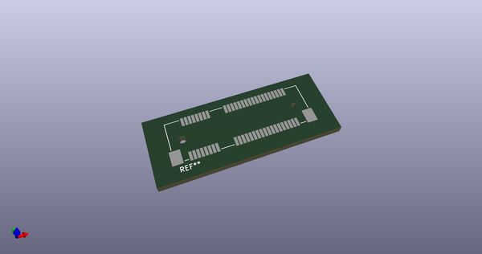
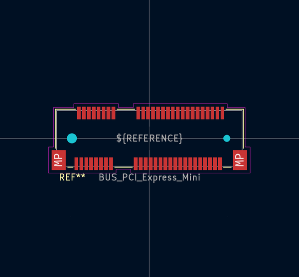
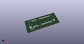
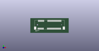

# OOMP Footprint  
##   by none  
  
oomp key: oomp_kicad_connector_pcbedge_bus_pci_express_mini  
  
source repo at: [http://gitlab.com/kicad/libraries/kicad-footprints//blob/master/tmp/libraries/kicad-footprints/Varistor.pretty/RV_Rect_V25S440P_L26.5mm_W8.2mm_P12.7mm.kicad_mod](http://gitlab.com/kicad/libraries/kicad-footprints//blob/master/tmp/libraries/kicad-footprints/Varistor.pretty/RV_Rect_V25S440P_L26.5mm_W8.2mm_P12.7mm.kicad_mod)  
## Footprint  
  
  
  
  
| name | value | 
| --- | --- | 
| footprint name |  | 
| footprint description |  | 
| number of pads |  | 
| github path | http://github.com/kicad/libraries/kicad-footprints//blob/master/tmp/libraries/kicad-footprints/Connector_PCBEdge.pretty/BUS_PCI_Express_Mini.kicad_mod | 
| oomp key | oomp_kicad_connector_pcbedge_bus_pci_express_mini | 
| oomp bot github | https://github.com/oomlout/oomlout_oomp_footprint_bot/tree/main/footprints/kicad_connector_pcbedge_bus_pci_express_mini/working | 
## Images  
  
  
  
  
  
  
  
  
