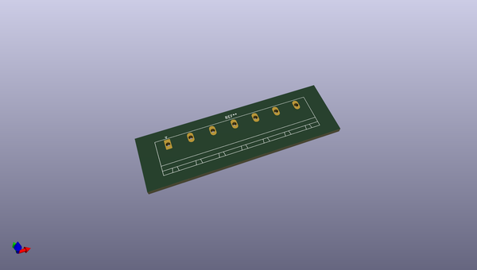

# OOMP Footprint  
## PhoenixContact_GMSTBA_2,5_7-G_1x07_P7.50mm_Horizontal  by none  
  
oomp key: oomp_kicad_connector_phoenix_gmstb_phoenixcontact_gmstba_2,5_7_g_1x07_p7_50mm_horizontal  
  
source repo at: [http://gitlab.com/kicad/libraries/kicad-footprints//blob/master/tmp/libraries/kicad-footprints/Varistor.pretty/RV_Rect_V25S440P_L26.5mm_W8.2mm_P12.7mm.kicad_mod](http://gitlab.com/kicad/libraries/kicad-footprints//blob/master/tmp/libraries/kicad-footprints/Varistor.pretty/RV_Rect_V25S440P_L26.5mm_W8.2mm_P12.7mm.kicad_mod)  
## Footprint  
  
  
  
  
| name | value | 
| --- | --- | 
| footprint name | PhoenixContact_GMSTBA_2,5_7-G_1x07_P7.50mm_Horizontal | 
| footprint description | Generic Phoenix Contact connector footprint for: GMSTBA_2,5/7-G; number of pins: 07; pin pitch: 7.50mm; Angled || order number: 1766398 12A 630V | 
| number of pads | 7 | 
| github path | http://github.com/kicad/libraries/kicad-footprints//blob/master/tmp/libraries/kicad-footprints/Connector_Phoenix_GMSTB.pretty/PhoenixContact_GMSTBA_2,5_7-G_1x07_P7.50mm_Horizontal.kicad_mod | 
| oomp key | oomp_kicad_connector_phoenix_gmstb_phoenixcontact_gmstba_2,5_7_g_1x07_p7_50mm_horizontal | 
| oomp bot github | https://github.com/oomlout/oomlout_oomp_footprint_bot/tree/main/footprints/kicad_connector_phoenix_gmstb_phoenixcontact_gmstba_2,5_7_g_1x07_p7_50mm_horizontal/working | 
## Images  
