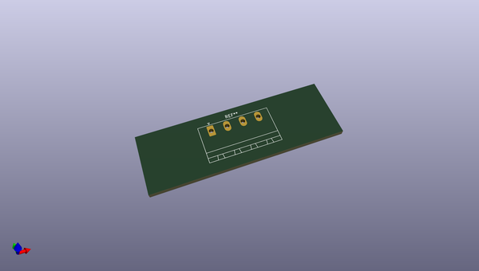
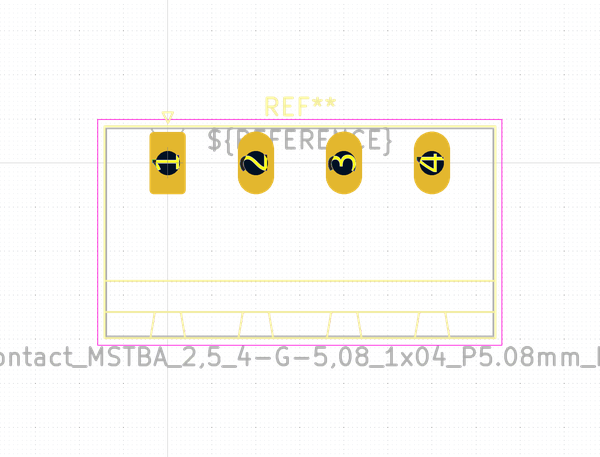

# OOMP Footprint  
## PhoenixContact_MSTBA_2,5_4-G-5,08_1x04_P5.08mm_Horizontal  by none  
  
oomp key: oomp_kicad_connector_phoenix_mstb_phoenixcontact_mstba_2,5_4_g_5,08_1x04_p5_08mm_horizontal  
  
source repo at: [http://gitlab.com/kicad/libraries/kicad-footprints//blob/master/tmp/libraries/kicad-footprints/Varistor.pretty/RV_Rect_V25S440P_L26.5mm_W8.2mm_P12.7mm.kicad_mod](http://gitlab.com/kicad/libraries/kicad-footprints//blob/master/tmp/libraries/kicad-footprints/Varistor.pretty/RV_Rect_V25S440P_L26.5mm_W8.2mm_P12.7mm.kicad_mod)  
## Footprint  
  
  
  
  
| name | value | 
| --- | --- | 
| footprint name | PhoenixContact_MSTBA_2,5_4-G-5,08_1x04_P5.08mm_Horizontal | 
| footprint description | Generic Phoenix Contact connector footprint for: MSTBA_2,5/4-G-5,08; number of pins: 04; pin pitch: 5.08mm; Angled || order number: 1757268 12A || order number: 1923885 16A (HC) | 
| number of pads | 4 | 
| github path | http://github.com/kicad/libraries/kicad-footprints//blob/master/tmp/libraries/kicad-footprints/Connector_Phoenix_MSTB.pretty/PhoenixContact_MSTBA_2,5_4-G-5,08_1x04_P5.08mm_Horizontal.kicad_mod | 
| oomp key | oomp_kicad_connector_phoenix_mstb_phoenixcontact_mstba_2,5_4_g_5,08_1x04_p5_08mm_horizontal | 
| oomp bot github | https://github.com/oomlout/oomlout_oomp_footprint_bot/tree/main/footprints/kicad_connector_phoenix_mstb_phoenixcontact_mstba_2,5_4_g_5,08_1x04_p5_08mm_horizontal/working | 
## Images  
