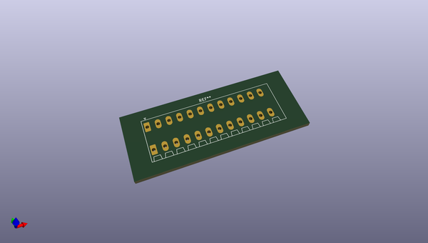
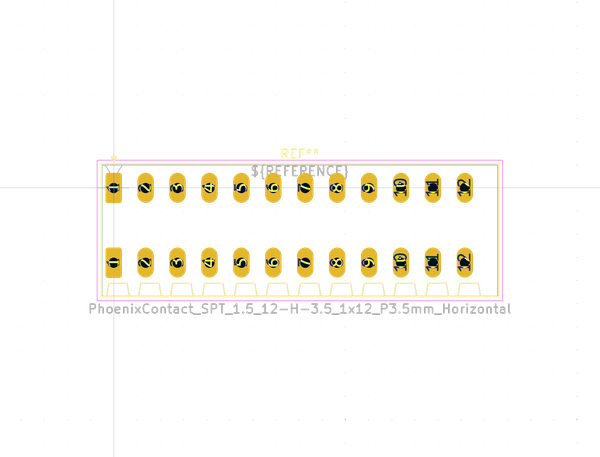

# OOMP Footprint  
##   by none  
  
oomp key: oomp_kicad_connector_phoenix_spt_phoenixcontact_spt_1_5_12_h_3_5_1x12_p3_5mm_horizontal  
  
source repo at: [http://gitlab.com/kicad/libraries/kicad-footprints//blob/master/tmp/libraries/kicad-footprints/Varistor.pretty/RV_Rect_V25S440P_L26.5mm_W8.2mm_P12.7mm.kicad_mod](http://gitlab.com/kicad/libraries/kicad-footprints//blob/master/tmp/libraries/kicad-footprints/Varistor.pretty/RV_Rect_V25S440P_L26.5mm_W8.2mm_P12.7mm.kicad_mod)  
## Footprint  
  
  
  
  
| name | value | 
| --- | --- | 
| footprint name |  | 
| footprint description |  | 
| number of pads |  | 
| github path | http://github.com/kicad/libraries/kicad-footprints//blob/master/tmp/libraries/kicad-footprints/Connector_Phoenix_SPT.pretty/PhoenixContact_SPT_1.5_12-H-3.5_1x12_P3.5mm_Horizontal.kicad_mod | 
| oomp key | oomp_kicad_connector_phoenix_spt_phoenixcontact_spt_1_5_12_h_3_5_1x12_p3_5mm_horizontal | 
| oomp bot github | https://github.com/oomlout/oomlout_oomp_footprint_bot/tree/main/footprints/kicad_connector_phoenix_spt_phoenixcontact_spt_1_5_12_h_3_5_1x12_p3_5mm_horizontal/working | 
## Images  
