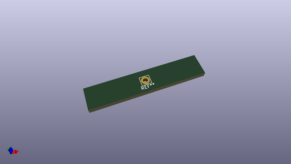
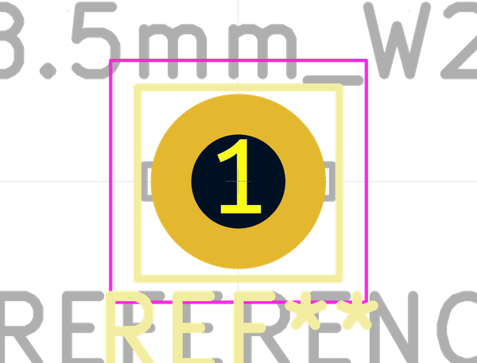

# OOMP Footprint  
## Pin_D1.4mm_L8.5mm_W2.8mm_FlatFork  by none  
  
oomp key: oomp_kicad_connector_pin_pin_d1_4mm_l8_5mm_w2_8mm_flatfork  
  
source repo at: [http://gitlab.com/kicad/libraries/kicad-footprints//blob/master/tmp/libraries/kicad-footprints/Varistor.pretty/RV_Rect_V25S440P_L26.5mm_W8.2mm_P12.7mm.kicad_mod](http://gitlab.com/kicad/libraries/kicad-footprints//blob/master/tmp/libraries/kicad-footprints/Varistor.pretty/RV_Rect_V25S440P_L26.5mm_W8.2mm_P12.7mm.kicad_mod)  
## Footprint  
  
  
  
  
| name | value | 
| --- | --- | 
| footprint name | Pin_D1.4mm_L8.5mm_W2.8mm_FlatFork | 
| footprint description | solder Pin_ with flat with fork, hole diameter 1.4mm, length 8.5mm, width 2.8mm, e.g. Ettinger 13.13.890, https://katalog.ettinger.de/#p=434 | 
| number of pads | 1 | 
| github path | http://github.com/kicad/libraries/kicad-footprints//blob/master/tmp/libraries/kicad-footprints/Connector_Pin.pretty/Pin_D1.4mm_L8.5mm_W2.8mm_FlatFork.kicad_mod | 
| oomp key | oomp_kicad_connector_pin_pin_d1_4mm_l8_5mm_w2_8mm_flatfork | 
| oomp bot github | https://github.com/oomlout/oomlout_oomp_footprint_bot/tree/main/footprints/kicad_connector_pin_pin_d1_4mm_l8_5mm_w2_8mm_flatfork/working | 
## Images  
