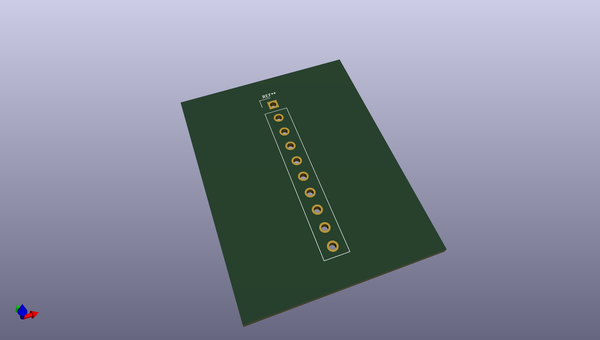
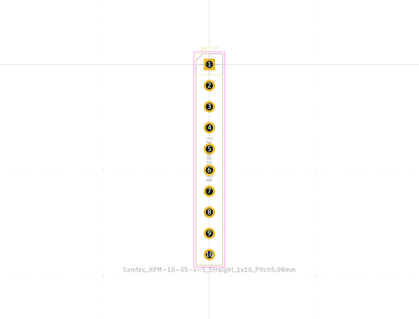

# OOMP Footprint  
## Samtec_HPM-10-05-x-S_Straight_1x10_Pitch5.08mm  by none  
  
oomp key: oomp_kicad_connector_samtec_hpm_tht_samtec_hpm_10_05_x_s_straight_1x10_pitch5_08mm  
  
source repo at: [http://gitlab.com/kicad/libraries/kicad-footprints//blob/master/tmp/libraries/kicad-footprints/Varistor.pretty/RV_Rect_V25S440P_L26.5mm_W8.2mm_P12.7mm.kicad_mod](http://gitlab.com/kicad/libraries/kicad-footprints//blob/master/tmp/libraries/kicad-footprints/Varistor.pretty/RV_Rect_V25S440P_L26.5mm_W8.2mm_P12.7mm.kicad_mod)  
## Footprint  
  
  
  
  
| name | value | 
| --- | --- | 
| footprint name | Samtec_HPM-10-05-x-S_Straight_1x10_Pitch5.08mm | 
| footprint description | Through hole straight Samtec HPM power header series 3.81mm post length, 1x10, 5.08mm pitch, single row | 
| number of pads | 10 | 
| github path | http://github.com/kicad/libraries/kicad-footprints//blob/master/tmp/libraries/kicad-footprints/Connector_Samtec_HPM_THT.pretty/Samtec_HPM-10-05-x-S_Straight_1x10_Pitch5.08mm.kicad_mod | 
| oomp key | oomp_kicad_connector_samtec_hpm_tht_samtec_hpm_10_05_x_s_straight_1x10_pitch5_08mm | 
| oomp bot github | https://github.com/oomlout/oomlout_oomp_footprint_bot/tree/main/footprints/kicad_connector_samtec_hpm_tht_samtec_hpm_10_05_x_s_straight_1x10_pitch5_08mm/working | 
## Images  
