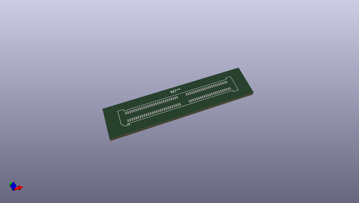
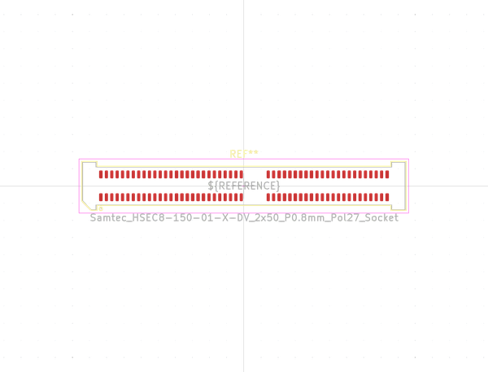

# OOMP Footprint  
##   by none  
  
oomp key: oomp_kicad_connector_samtec_hsec8_samtec_hsec8_150_01_x_dv_2x50_p0_8mm_pol27_socket  
  
source repo at: [http://gitlab.com/kicad/libraries/kicad-footprints//blob/master/tmp/libraries/kicad-footprints/Varistor.pretty/RV_Rect_V25S440P_L26.5mm_W8.2mm_P12.7mm.kicad_mod](http://gitlab.com/kicad/libraries/kicad-footprints//blob/master/tmp/libraries/kicad-footprints/Varistor.pretty/RV_Rect_V25S440P_L26.5mm_W8.2mm_P12.7mm.kicad_mod)  
## Footprint  
  
  
  
  
| name | value | 
| --- | --- | 
| footprint name |  | 
| footprint description |  | 
| number of pads |  | 
| github path | http://github.com/kicad/libraries/kicad-footprints//blob/master/tmp/libraries/kicad-footprints/Connector_Samtec_HSEC8.pretty/Samtec_HSEC8-150-01-X-DV_2x50_P0.8mm_Pol27_Socket.kicad_mod | 
| oomp key | oomp_kicad_connector_samtec_hsec8_samtec_hsec8_150_01_x_dv_2x50_p0_8mm_pol27_socket | 
| oomp bot github | https://github.com/oomlout/oomlout_oomp_footprint_bot/tree/main/footprints/kicad_connector_samtec_hsec8_samtec_hsec8_150_01_x_dv_2x50_p0_8mm_pol27_socket/working | 
## Images  
