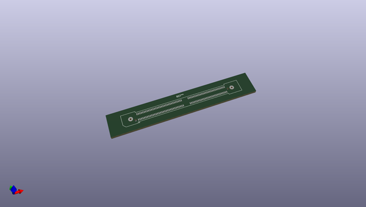
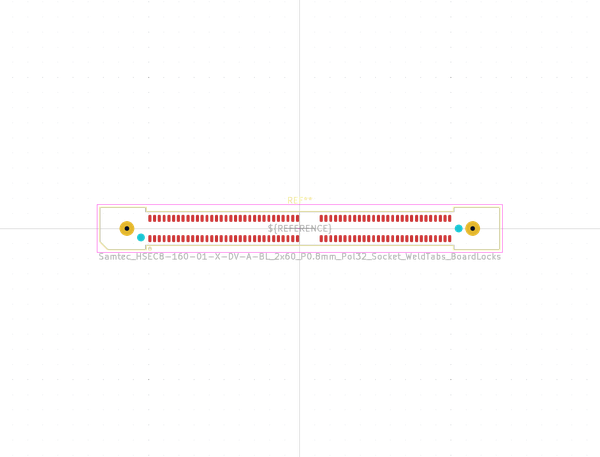

# OOMP Footprint  
##   by none  
  
oomp key: oomp_kicad_connector_samtec_hsec8_samtec_hsec8_160_01_x_dv_a_bl_2x60_p0_8mm_pol32_socket_weldtabs_boardlocks  
  
source repo at: [http://gitlab.com/kicad/libraries/kicad-footprints//blob/master/tmp/libraries/kicad-footprints/Varistor.pretty/RV_Rect_V25S440P_L26.5mm_W8.2mm_P12.7mm.kicad_mod](http://gitlab.com/kicad/libraries/kicad-footprints//blob/master/tmp/libraries/kicad-footprints/Varistor.pretty/RV_Rect_V25S440P_L26.5mm_W8.2mm_P12.7mm.kicad_mod)  
## Footprint  
  
  
  
  
| name | value | 
| --- | --- | 
| footprint name |  | 
| footprint description |  | 
| number of pads |  | 
| github path | http://github.com/kicad/libraries/kicad-footprints//blob/master/tmp/libraries/kicad-footprints/Connector_Samtec_HSEC8.pretty/Samtec_HSEC8-160-01-X-DV-A-BL_2x60_P0.8mm_Pol32_Socket_WeldTabs_BoardLocks.kicad_mod | 
| oomp key | oomp_kicad_connector_samtec_hsec8_samtec_hsec8_160_01_x_dv_a_bl_2x60_p0_8mm_pol32_socket_weldtabs_boardlocks | 
| oomp bot github | https://github.com/oomlout/oomlout_oomp_footprint_bot/tree/main/footprints/kicad_connector_samtec_hsec8_samtec_hsec8_160_01_x_dv_a_bl_2x60_p0_8mm_pol32_socket_weldtabs_boardlocks/working | 
## Images  
